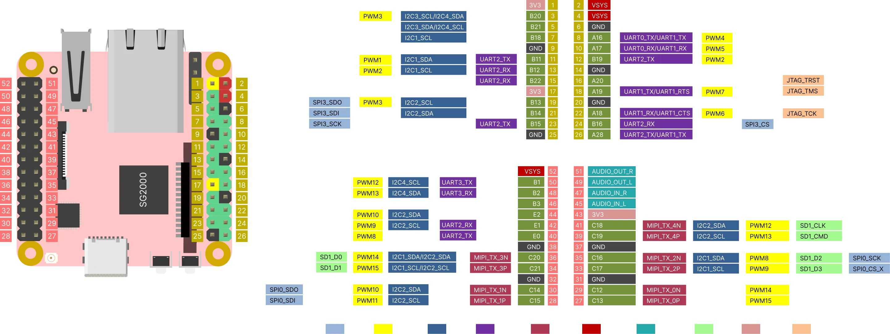

попались мне как то на Али, пару платок Milk-V Duo, Milk-V Duo 256M,

я так понял, эти мк а точнее это уже Система на чипе (SoC, System on Chip)
используют в каких то устройствах с большими тиражами
поэтому они относительно не дорогие, и данная фирма, сделала для радиолюбителей несколько devboard

milkv-duo and milkv-duo 256m front

milkv-duo and milkv-duo 256m back

[overview](https://milkv.io/ru/docs/duo/overview)

*******************************************************************************
[Milk-V Duo](https://milkv.io/docs/duo/getting-started/duo)
~~~
	Milk-V Duo

SoC	CVITEK CV1800B
	1GHz and 700MHz RISC-V C906 processors
	Integrated CVITEK TPU for smart detection.
	SIP DRAM 64MB
	Supports H.264/H.265 video encoding, up to 2880x1620@20fps.
	Compatible with high-definition CMOS sensors.
	Programmable frequency output for sensor clock.
	Comprehensive ISP features for image optimization.
	Partial OpenCV library support with CV hardware acceleration.
	16-bit audio codec with built-in mic input and output functions.
	Flexible network configurations with 1 Ethernet PHY.

RISC-V CPU	C906@1Ghz (Vector+FPU)  +  C906@700MHz (FPU)
        *насколько я понял, это 2 разных CPU но общей шине,
         1Ghz - с раширениями комманд RISC-V для запуска Linux
         700MHz - используют для RTOS, набор комманд RISC-V - Linux не поддерживает ("из коробки")

MCU	8051@8KB SRAM
        *Подсистема 8051 расположена в модуле, который независимо питается от RTC. 
	Подсистема сконфигурирована с 8051, контроллером I2C/UART/SPI NOR/SD, таймером/WDT,
	управлением прерываниями и mailbox IP (взаимодействие между CPU).
	Системное программное обеспечение может использовать 8051 для управления
	пробуждением системы, когда она находится в спящем режиме.

TPU	0.5TOPS@INT8
         *can be used to accelerate image classification, object detection,
         face detection and recognition, segmentation, LSTM, and more.

Storage	1x слот для MicroSD
        1x паяльная площадка SD NAND

Memory	SIP DRAM 64MB DDR2

USB	1х порт USB type-C for power and data
        1x паяльная площадка USB2

CSI	1 x 16P FPC connector (MIPI CSI 2-lane)

Sensor Support	4M @ 25fps

Ethernet	10/100Mbps ethernet with PHY
         *есть 5-контактная площадка PHY для припайки коннектора "трансформатор и разъем RJ45"

GPIO	up to 26 Pins available for general purpose I/O（GPIO）
        *Интерфейсы ввода/вывода:
	26x GPIO, если на них не сконфигурировано:
	 3x I2C
         5x UART
         1x SPI
	 2x АЦП
         7x PWM
	 1x SDIO
         1x JTAG

Power	5V/1A

OS Support	Buildroot, RTOS

Size	21mm*51mm
~~~
*******************************************************************************

*******************************************************************************
[Milk-V Duo 256M](https://milkv.io/docs/duo/getting-started/duo256m)

	Milk-V  Duo 256M
~~~
SoC	SG2002
	1GHz and 700MHz RISC-V C906 processors
	Optional T-Head C906@1GHz or Cortex-A53@1GHz
	Integrated 1TOPS@INT8 TPU for smart detection.
	SIP DRAM 256MB
	Supports H.264/H.265 video encoding, up to 5M@30fps.
	Compatible with high-definition CMOS sensors.
	Support Multiple storage devices via SPI-NOR, SPI-NAND, eMMC5.0, 2 x SDIO3.0 interfaces
	Comprehensive ISP features for image optimization.
	Partial OpenCV library support with CV hardware acceleration.
	16-bit audio codec with built-in mic input and output functions.
	2L MIPI DSI 5M@30fps
	4L or 2L+2L MIPI CSI 5M@30fps
	Flexible network configurations with 1 Ethernet PHY.
	QFN88

RISC-V CPU  C906@1Ghz (Vector+FPU)  +  C906@700MHz (FPU)
        *насколько я понял, это 2 разных CPU но общей шине,
         1Ghz - с раширениями комманд RISC-V для запуска Linux
         700MHz - используют для RTOS, набор комманд RISC-V - Linux не поддерживает ("из коробки")

Arm CPU	1 x Cortex-A53@1GHz (neon+FPU)
	*насколько я понял, при старте MK - проверяеться ножка boot, и исходя из этого
         стартует либо C906@1Ghz либо A53@1GHz - т.е. одновременно они не работают.

MCU	8051@8KB SRAM  (25Mz - 300Mz)
        *Подсистема 8051 расположена в модуле, который независимо питается от RTC. 
	Подсистема сконфигурирована с 8051, контроллером I2C/UART/SPI NOR/SD, таймером/WDT,
	управлением прерываниями и mailbox IP (взаимодействие между CPU).
	Системное программное обеспечение может использовать 8051 для управления
	пробуждением системы, когда она находится в спящем режиме.

TPU	1TOPS@INT8
         *can be used to accelerate image classification, object detection,
         face detection and recognition, segmentation, LSTM, and more.

Storage	1x слот для MicroSD
        1x паяльная площадка SD NAND

Memory	SIP DRAM 256MB DDR2

USB	1х порт USB type-C for power and data
        1x паяльная площадка USB2

CSI	1 x 16P FPC connector (MIPI CSI 2-lane)

Sensor Support	5M @ 30fps

Ethernet	100Mbps ethernet with PHY
         *есть 5-контактная площадка PHY для припайки коннектора "трансформатор и разъем RJ45"

Audio	Via GPIO Pads

GPIO	up to 26 Pins available for general purpose I/O（GPIO）
        *Интерфейсы ввода/вывода:
	26x GPIO, если на них не сконфигурировано:
	 3x I2C
         5x UART
         1x SPI
	 2x АЦП
         7x PWM
	 1x SDIO
         1x JTAG

Power	5V/1A

OS Support	Buildroot, RTOS

Size	21mm*51mm
~~~
*******************************************************************************

*******************************************************************************
[Milk-V Duo S](https://milkv.io/docs/duo/getting-started/duos)

~~~
Milk-V Duo S is an upgraded model of Duo,
 featuring an upgraded SG2000 main controller with a larger 512MB memory and expanded IO capabilities.

 It integrates wireless capabilities with WI-FI 6/BT 5,
 and comes equipped with a USB 2.0 HOST interface
 and a 100Mbps Ethernet port for user convenience.

 Supporting dual cameras (2x MIPI CSI 2-lane) and MIPI video output (MIPI DSI 4-lane),
 it allows for versatile applications.

 The device also supports switching between RISC-V and ARM boot through a switch.

https://milkv.io/chips/sg2000

Hardware

RISC-V CPU
	1 x C906@1GHz + 1 x C906@700MHz

Arm CPU
	1 x Cortex-A53@1GHz

MCU
	8051@6KB SRAM

NPU
	0.5 TOPS@INT8

Memory
	Sip DRAM 512M

Video Module
	ISP 5M@30fps
	2L MIPI DSI 5M@30fps
	4L or 2L+2L MIPI CSI 5M@30fps
	H.265/H.264 Decoding and Encoding 5M@30fps

Audio Module
	16bit Audio Codec
	2 x I2S/PCM
	1 x DMIC

Storage
	SPI-NOR, SPI-NAND, eMMC5.0, 2 x SDIO3.0

Network
	10M/100M MAC PHY

Security Module
	Crypto/Secure boot/TRNG/Efuze

Peripherals
	1 x USB2.0 DRD
        5 x UART
        4 x SPI
        16 x PWM
        1 x IR
        6 x I2C
        6 x ADC
        GPIOs

Temperature Range
	0℃～70℃

Package Type
	LFBGA

Package Dimensions
	10mm x 10mm x 1.3mm

Pin Pitch
	0.65mm

Total Pins
	205
~~~

[схема duo-s](doc/duo-s/duo_s_SCH_v1.1.pdf)

взято из https://github.com/sophgo/sophgo-doc  
[sg2000 technical reference manual](doc/duo-s/sg2000_trm_en.pdf)

прочие, в  
[Cvitek Reference Documentation](https://milkv.io/docs/duo/resources/mmf)  
[MIPI DSI Screen Development](https://milkv.io/docs/duo/low-level-dev/mipi-dsi)  

альтернативные загрузочные образы  
[third-party-img](https://milkv.io/docs/duo/resources/third-party-img)

Например  
[debian](https://github.com/Fishwaldo/sophgo-sg200x-debian)

прчее на community.milkv.io  
[Programming the 8051: Step1, the Compiler](https://community.milkv.io/t/programming-the-8051-step1-the-compiler/1448)  
[Programming the 8051: Step 2, peripheral theory and access](https://community.milkv.io/t/programming-the-8051-step-2-peripheral-theory-and-access/1453)  
[Programming the 8051: Step3, 8051-only Blinky](https://community.milkv.io/t/programming-the-8051-step3-8051-only-blinky/1595)

*******************************************************************************

