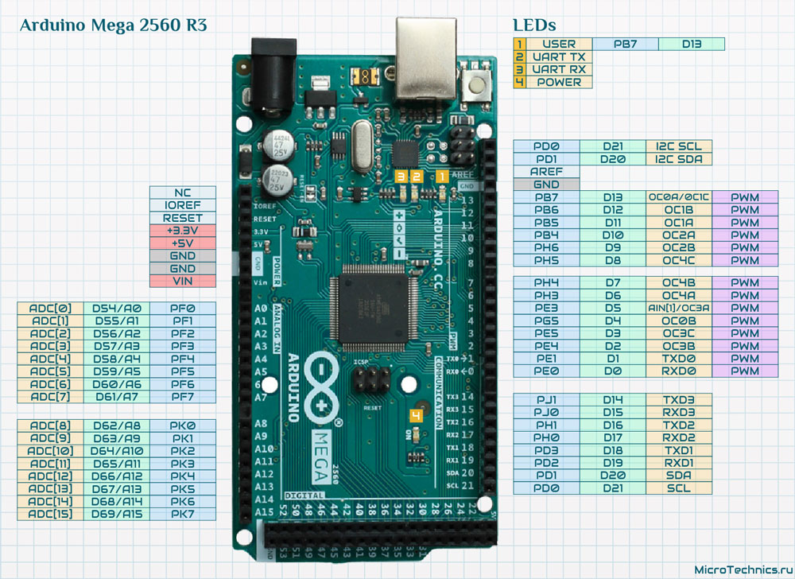
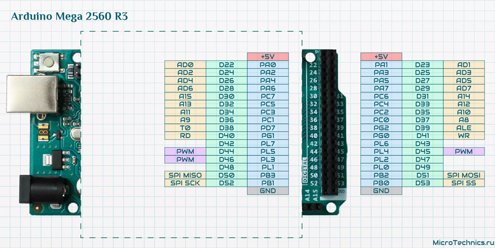

[arduino-mega-2560-r3-schematic](arduino-mega-2560-r3-schematic.pdf)

просто из даташита

[Datasheet](https://static.chipdip.ru/lib/934/DOC011934714.pdf)

[Datasheet ATmega2560](https://static.chipdip.ru/lib/436/DOC005436726.pdf)

Atmel ATmega640/V-1280/V-1281/V-2560/V-2561/V
8-bit Atmel Microcontroller with 16/32/64KB In-System Programmable Flash

~~~
Features
• High Performance, Low Power Atmel® AVR® 8-Bit Microcontroller
• Advanced RISC Architecture
– 135 Powerful Instructions – Most Single Clock Cycle Execution
– 32 × 8 General Purpose Working Registers
– Fully Static Operation
– Up to 16 MIPS Throughput at 16MHz
– On-Chip 2-cycle Multiplier
• High Endurance Non-volatile Memory Segments
– 64K/128K/256KBytes of In-System Self-Programmable Flash
– 4Kbytes EEPROM
– 8Kbytes Internal SRAM
– Write/Erase Cycles:10,000 Flash/100,000 EEPROM
– Data retention: 20 years at 85C/ 100 years at 25C
– Optional Boot Code Section with Independent Lock Bits
• In-System Programming by On-chip Boot Program
• True Read-While-Write Operation
– Programming Lock for Software Security
• Endurance: Up to 64Kbytes Optional External Memory Space
• Atmel® QTouch® library support
– Capacitive touch buttons, sliders and wheels
– QTouch and QMatrix acquisition
– Up to 64 sense channels
• JTAG (IEEE® std. 1149.1 compliant) Interface
– Boundary-scan Capabilities According to the JTAG Standard
– Extensive On-chip Debug Support
– Programming of Flash, EEPROM, Fuses, and Lock Bits through the JTAG Interface
• Peripheral Features
– Two 8-bit Timer/Counters with Separate Prescaler and Compare Mode
– Four 16-bit Timer/Counter with Separate Prescaler, Compare- and Capture Mode
– Real Time Counter with Separate Oscillator
– Four 8-bit PWM Channels
– Six/Twelve PWM Channels with Programmable Resolution from 2 to 16 Bits
(ATmega1281/2561, ATmega640/1280/2560)
– Output Compare Modulator
– 8/16-channel, 10-bit ADC (ATmega1281/2561, ATmega640/1280/2560)
– Two/Four Programmable Serial USART (ATmega1281/2561, ATmega640/1280/2560)
– Master/Slave SPI Serial Interface
– Byte Oriented 2-wire Serial Interface
– Programmable Watchdog Timer with Separate On-chip Oscillator
– On-chip Analog Comparator
– Interrupt and Wake-up on Pin Change
• Special Microcontroller Features
– Power-on Reset and Programmable Brown-out Detection
– Internal Calibrated Oscillator
– External and Internal Interrupt Sources
– Six Sleep Modes: Idle, ADC Noise Reduction, Power-save, Power-down, Standby,
and Extended Standby
• I/O and Packages
– 54/86 Programmable I/O Lines (ATmega1281/2561, ATmega640/1280/2560)
– 64-pad QFN/MLF, 64-lead TQFP (ATmega1281/2561)
– 100-lead TQFP, 100-ball CBGA (ATmega640/1280/2560)
– RoHS/Fully Green
• Temperature Range:
– -40C to 85C Industrial
• Ultra-Low Power Consumption
– Active Mode: 1MHz, 1.8V: 500µA
– Power-down Mode: 0.1µA at 1.8V
• Speed Grade:
– ATmega640V/ATmega1280V/ATmega1281V:
• 0 - 4MHz @ 1.8V - 5.5V, 0 - 8MHz @ 2.7V - 5.5V
– ATmega2560V/ATmega2561V:
• 0 - 2MHz @ 1.8V - 5.5V, 0 - 8MHz @ 2.7V - 5.5V
– ATmega640/ATmega1280/ATmega1281:
• 0 - 8MHz @ 2.7V - 5.5V, 0 - 16MHz @ 4.5V - 5.5V
– ATmega2560/ATmega2561:
• 0 - 16MHz @ 4.5V - 5.5V
~~~

PS:
  To teach the reader how to program Arduino based on AVR ATMEGA 2560 directly using avrgcc.
  Hence, I have tried to keep the code as simple as possible.
  [Elegoo_Mega_2560](https://github.com/enthusiasticgeek/Elegoo_Mega_2560.git)

linux install
 sudo dnf install avr-gcc avr-gcc-c++ avr-libc avrdude
