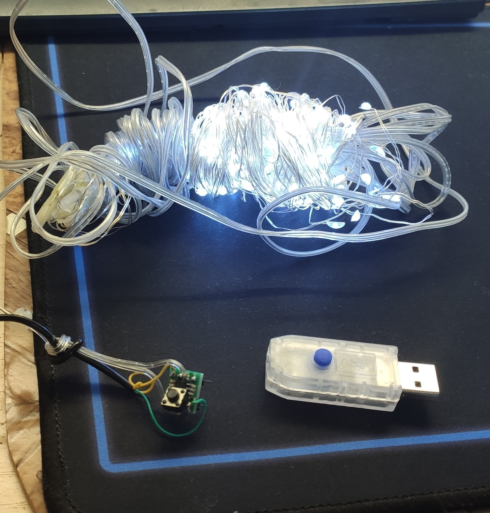
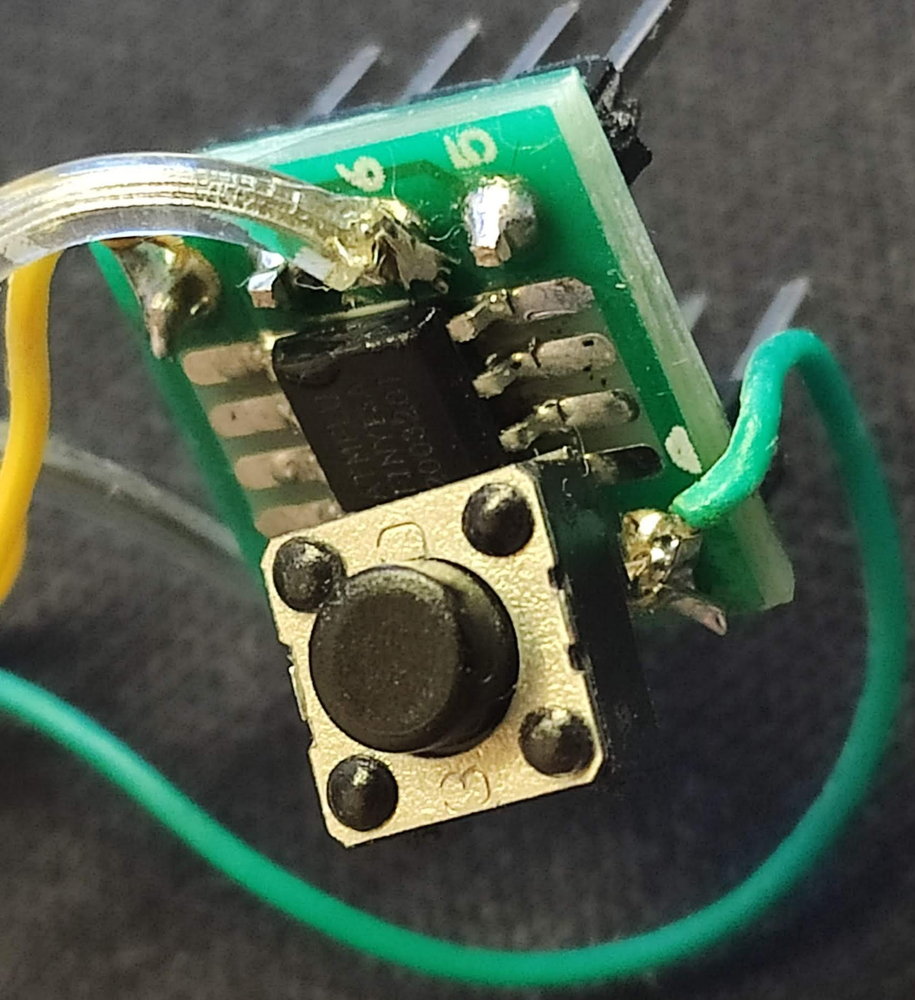

поменял контроллер на дешёвой USB гирлянде

использовав Attiny13A

[Видео youtu](https://youtu.be/A7c0qRhjPbY?si=3YPNpMdUkgfG_Zxz)

[Видео rutube](https://rutube.ru/video/fc1911c28bc9dab0a010f8cba6210e68/?r=wd)

надо соединить по схеме:
~~~

Attiny13A  
--------    
2 PB3    --button--> GND

3 PB4    --LED strip--|
6 PB1    --LED strip--|

8 Vcc    5V
4 GND    GND
------ 

~~~

