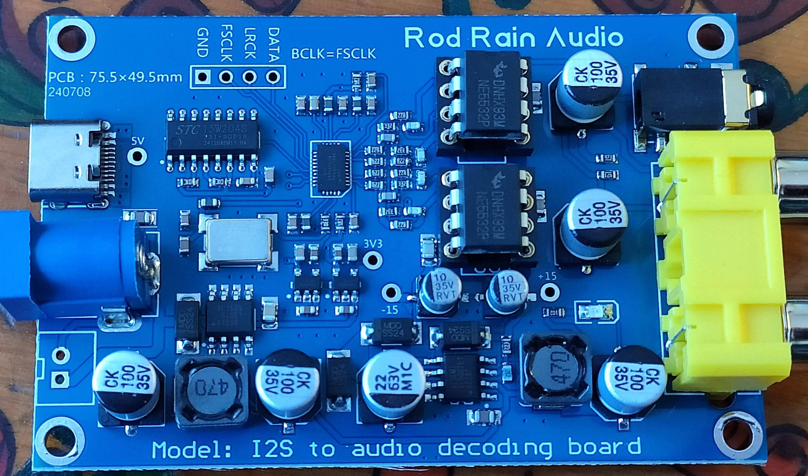
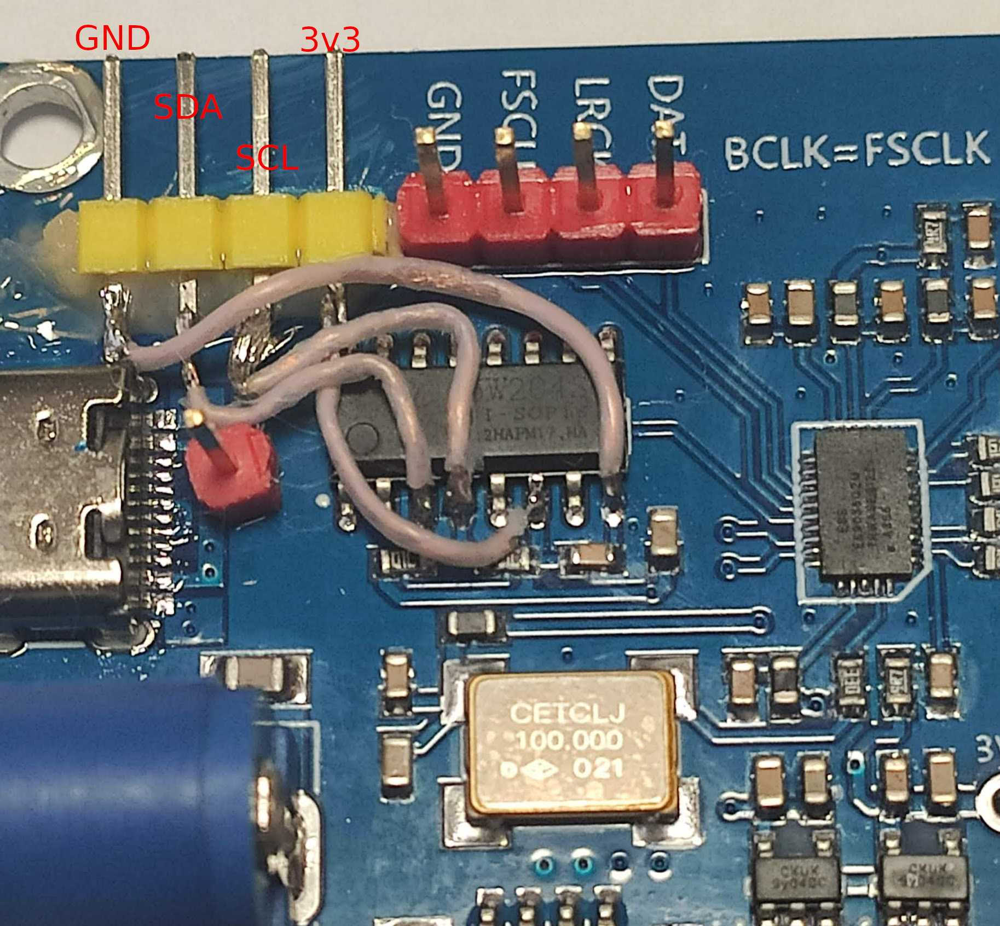
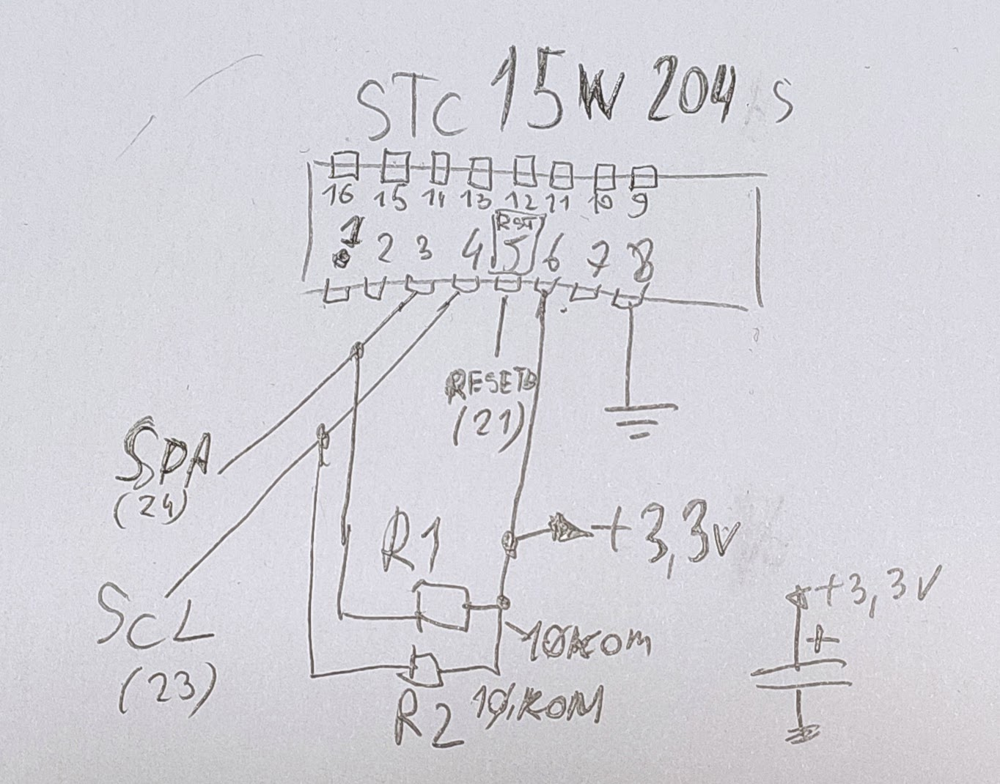
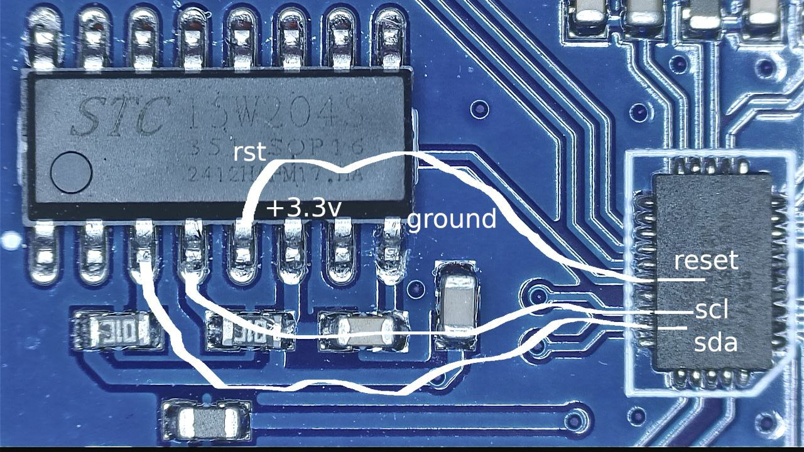
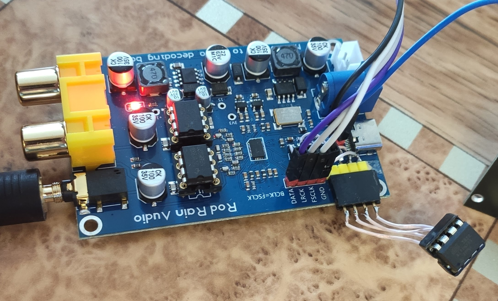
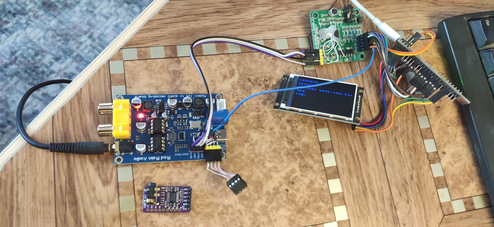
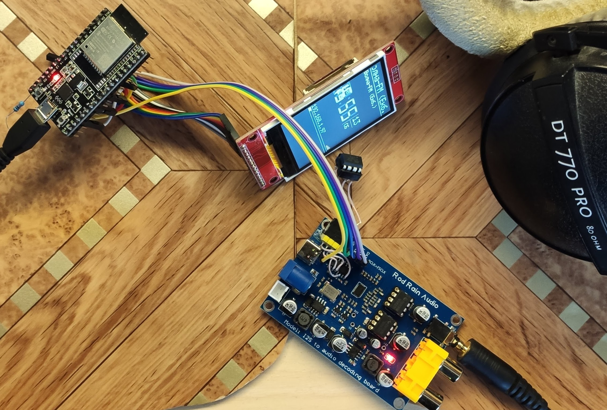
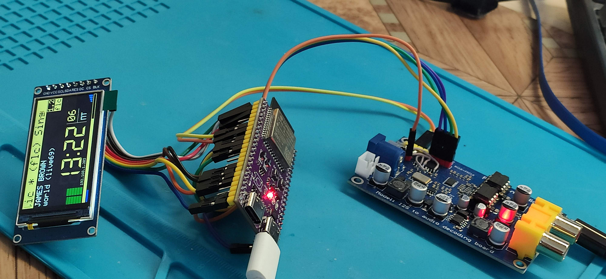

вот такую платку es9038q2m, решил переделать на 16 бит, для подключения по i2s к соответствующим источникам звука.

подпаял разъем 

ближе

схема

так

к разъёму подключил Attiny85

тестировал на таком стенде, 
 тут i2s берётся с vs1053b,
 просто у меня такая схема лежала собранной

протестировал с yoRadio, работает!

файл, лог скана i2c 

[decoder--250516-164223.txt](decoder--250516-164223.txt)

прога для переключения

[attiny85_wire1.ino](attiny85_wire1.ino)

прг. для включения режима 16-bit data words, для es9038q2m

для мк Attiny85 (была в наличии, показалось что норм. + )

и на Arduino (переделать на что то другое, не проблема....)

делал по статье [https://alexgyver.ru/lessons/naked-chip/](https://alexgyver.ru/lessons/naked-chip/)

~~~
для ATTinyCore – ядро для поддержки и расширенной настройки МК ATtiny 441/841, 44/84, 45/85, 461/861, 48/88, 828, 1634, 87, 167. 
    Ссылка для менеджера плат: http://drazzy.com/package_drazzy.com_index.json

плата выбрана "Attiny25/45/85 (no bootloader)" 

выводы:
ATtiny85 as an I2C Master. cpu @ 8MHz 
ATtiny Pin 4 = Gnd
ATtiny Pin 5 = SDA 
ATtiny Pin 7 = SCK 
ATtiny Pin 8 = VCC +3.3 

~~~
взял оттуда константы для программы (тут обсуждает другую платку, тоже на основе es9038q2m)

[форум chipdip es9038q2m](https://forum.chipdip.ru/index.php?threads/es9038q2m-%D0%B0%D1%83%D0%B4%D0%B8%D0%BE-%D0%A6%D0%90%D0%9F.474/page-21#post-15544)

Всё

---PS: 15-08-2025---

 а нет, не Всё

в продолжение темы, сделал плагин для yoRadio, по просьбе одного товарища

папку с плагином [es9038q2m_init](es9038q2m_init)

ложим в папку yoRadio/src/src/plugins

... (компилим, заливаем)

выводы для подключения указываються в [es9038q2m/_init/es9038q2m_init.cpp](es9038q2m_init.cpp)

задано SDA = GPIO-6, SCL = GPIO-7 тут:
~~~
#define EQ_SDA_PIN 6
#define EQ_SCL_PIN 7
~~~

если надо другие, меняем...

