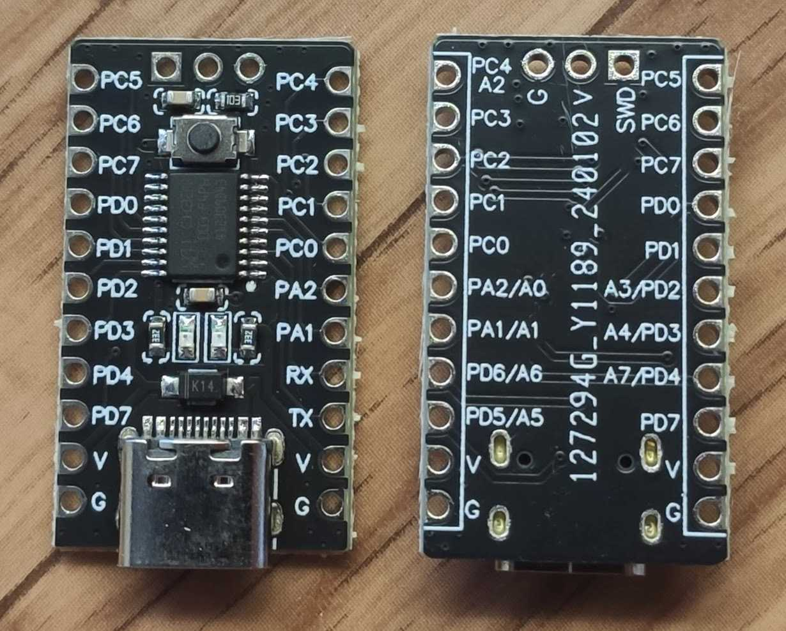

Платка CH32V003 или её еще просто обзывают TWen32F003 на МК CH32V003F4P6
их несколько вариантов

мне попалась с кнопкой и двумя светодиодами - зелёным и красным,
	   кнопка (+RC цепочка) подсоединена к питанию и выводу PC0, 
	   красный светиться когда загружаешь прошивку - к выводу SWD подсоединён,
	   зелёный POWER - подсоединён к земле и питанию (через резистор) 

~~~
https://www.wch-ic.com/products/CH32V003.html

CH32V003F4P6 корпус TSSOP20

Features

Core
 - QingKe 32-bit RISC-V core, RV32EC instruction set
 - Fast programmable interrupt controller + hardware interrupt stack
 - Support 2-level interrupt nesting
 - Support system main frequency 48MHz

Memory
 - 2KB volatile data storage area SRAM
 - 16KB program memory CodeFlash
 - 1920B BootLoader
 - 64B non-volatile system configuration memory
 - 64B user-defined memory

Power management and low-power consumption
 - System power supply VDD: 3.3V or 5V
 - Low-power mode: Sleep, Standby

Clock & Reset
 - Built-in factory-trimmed 24MHz RC oscillator
 - Built-in 128KHz RC oscillator
 - High-speed external 4~25MHz oscillator
 - Power on/down reset, programmable voltage detector

7-channel general-purpose DMA controller
 - 7 channels, support ring buffer
 - Support TIMx/ADC /USART/I2C/SPI 

1 group of OPA and comparator: connected with ADC and TIM2

1 group of 10-bit ADC
 - Analog input range: 0~VDD
 - 8 external signals + 2 internal signals
 - Support external delayed triggering

Multiple timers
 - 16-bit advanced-control timer, with dead zone control and emergency brake; can offer PWM complementary output for motor control
 - 16-bit general-purpose timer, provide input capture/output comparison/PWM/pulse counting/incremental encoder input
 - 2 watchdog timers (independent watchdog and window watchdog)
 - SysTick: 32-bit counter

Communication interfaces
 - USART interface
 - I2C interface
 - SPI interface

GPIO port
 - 3 groups of GPIO ports, 18 I/O ports
 - Mapping 1 external interrupt

Security features: 96-bit unique ID

Debug mode: 1-wire serial debug interface (SDI)

~~~

~~~

напоминалка:

делал в fedora linux 39, в других возможно немного по другому надо

(1) установка пакетов для сборки riskv кода

$ sudo dnf install pnpm   (или может sudo dnf install npm ?)
$ sudo npm install --location=global xpm@latest
$ xpm install @xpack-dev-tools/riscv-none-elf-gcc@latest --global --verbose

************************************
    или, установка пакетов для сборки riskv кода - вручную (версия 14.2.0-2, проверяйте, вдруг есть новее)
$ cd ~
$ mkdir .local
$ cd .local
$ mkdir xPacks
$ cd xPacks/
$ mkdir @xpack-dev-tools
$ cd @xpack-dev-tools/
$ mkdir riscv-none-elf-gcc
$ cd riscv-none-elf-gcc/
$ mkdir 14.2.0-2.1
$ cd 14.2.0-2.1/
$ wget https://github.com/xpack-dev-tools/riscv-none-elf-gcc-xpack/releases/download/v14.2.0-2/xpack-riscv-none-elf-gcc-14.2.0-2-linux-x64.tar.gz
$ tar xzf xpack-riscv-none-elf-gcc-14.2.0-2-linux-x64.tar.gz
$ rm xpack-riscv-none-elf-gcc-14.2.0-2-linux-x64.tar.gz 
$ mv xpack-riscv-none-elf-gcc-14.2.0-2/ .content/
************************************

(2) утилита для прошивки через WCH-linkE (у меня версия WCH-linkE-R0-1v3.FP)

собираем из проекта 

https://github.com/cnlohr/ch32v003fun.git

возможно надо будет поставить
$ dnf install systemd-devel

minichlink

копируем оттуда файл
`99-minichlink.rules`
в
`/etc/udev/rules.d/`

$ sudo groupadd plugdev
$ sudo usermod -a -G plugdev cur_user
$ sudo reboot

(3)
 

~~~

PS:
 источники
https://github.com/xpack-dev-tools/riscv-none-elf-gcc-xpack
https://github.com/openwch/ch32v003
https://github.com/cnlohr/ch32v003fun
https://github.com/wuxx/CH32V003-makefile-example
https://github.com/gregdavill/CH32V307-makefile-example

# Datasheet and Reference and Core Manual
### Download URL

- CH32V003RM.PDF-http://www.wch-ic.com/downloads/CH32V003RM_PDF.html
- CH32V003DS0.PDF-http://www.wch-ic.com/downloads/CH32V003DS0_PDF.html
- QingKeV2_Processor_Manual.PDF-http://www.wch-ic.com/downloads/QingKeV2_Processor_Manual_PDF.html

