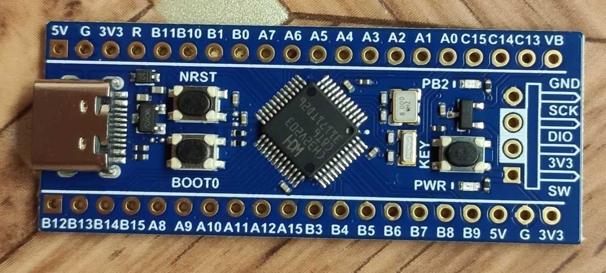

ch32v203c8t6

например: платка от WeAct 

Features
 Core:
- QingKe V4B 32-bit RISC-V core with multiple instruction set combinations
- Fast programmable interrupt controller + hardware interrupt stack
- Branch prediction, conflict handling mechanism
- Single cycle multiplication, hardware division, hardware FPU
- System main frequency 144MHz

 Memory:
- Available with up to 20KB volatile data storage area SRAM
- Available with 64KB program memory CodeFlash (zero-wait application area + non-zerowait data area)
- 28KB BootLoader
- 128B non-volatile system configuration memory
- 128B user-defined memory

 Power management and low-power consumption:
- System power supply VDD: 
   3.3V
- Independent power supply for GPIO unit VI/O:
   3.3V
- Low-power mode:
   Sleep, Stop, Standby
- VBAT independently powers RTC and backup register

 Clock & Reset:
- Built-in factory-trimmed 8MHz RC oscillator
- Built-in 40 KHz RC oscillator
- Built-in PLL, optional CPU clock up to 144MHz
- High-speed external 3~25MHz oscillator
- Low-speed external 32.768 KHz oscillator
- Power on/down reset, programmable voltage detector

 Real-time clock (RTC):
  32-bit independent RTC timer

 1 groups of 8-channel general-purpose DMA controllers:
- 8 channels, support ring buffer
- Support TIMx/ADC /USART/I2C/SPI

 2 groups of OPAs and comparators:
  connected with ADC and TIMx

 2 groups of 12-bit ADC:
- Analog input range: VSSA~VDDA
- 10 external signals + 2 internal signals
- On-chip temperature sensor
- Dual ADC conversion mode

 16-channels Touch-Key detection:

 Multiple timers:
- 1 16-bit advanced-control timers, with dead zone
  control and emergency brake; can offer PWM
  complementary output for motor control
- 3 16-bit general-purpose timers, provide input
  capture/output comparison/PWM/pulse
  counting/incremental encoder input
- 2 watchdog timers (independent watchdog and window watchdog)
- SysTick: 64-bit counter

 Communication interfaces:
- 4 USART interfaces
- 2 I2C interfaces (support SMBus/PMBus)
- 2 SPI interfaces
- USB2.0 full-speed device interface (full-speed and low-speed)
- USB2.0 full-speed host/device interface
- 1 CAN interfaces (2.0B active)

 Fast GPIO port
- 37 I/O ports, with 16 external interrupts

 Security features: 
  CRC unit, 96-bit unique ID

 Debug mode: 
  2-wire serial debug interface (SDI)

 Package: 
  LQFP48 

-------------------------------------------------
https://github.com/openwch/ch32v20x.git

-------------------------------------------------

~~~
connect to
v203   WCH-LinkE
-----  ------ 
PA13   swdio
PA14   swclk
NRST   NRST
3.3    3V3
GND    GND    
-----  ------ 

~~~

~~~

напоминалка:

делал в fedora linux 39, в других возможно немного по другому надо

(1) установка пакетов для сборки riskv кода

$ sudo dnf install pnpm   (или может sudo dnf install npm ?)
$ sudo npm install --location=global xpm@latest
$ xpm install @xpack-dev-tools/riscv-none-elf-gcc@latest --global --verbose

************************************
    или, установка пакетов для сборки riskv кода - вручную (версия 14.2.0-2, проверяйте, вдруг есть новее)
$ cd ~
$ mkdir .local
$ cd .local
$ mkdir xPacks
$ cd xPacks/
$ mkdir @xpack-dev-tools
$ cd @xpack-dev-tools/
$ mkdir riscv-none-elf-gcc
$ cd riscv-none-elf-gcc/
$ mkdir 14.2.0-2.1
$ cd 14.2.0-2.1/
$ wget https://github.com/xpack-dev-tools/riscv-none-elf-gcc-xpack/releases/download/v14.2.0-2/xpack-riscv-none-elf-gcc-14.2.0-2-linux-x64.tar.gz
$ tar xzf xpack-riscv-none-elf-gcc-14.2.0-2-linux-x64.tar.gz
$ rm xpack-riscv-none-elf-gcc-14.2.0-2-linux-x64.tar.gz 
$ mv xpack-riscv-none-elf-gcc-14.2.0-2/ .content/
************************************

(2) утилита для прошивки через WCH-linkE (у меня версия WCH-linkE-R0-1v3.FP)

собираем из проекта 

https://github.com/cnlohr/ch32v003fun.git

возможно надо будет поставить
$ dnf install systemd-devel

minichlink

копируем оттуда файл
`99-minichlink.rules`
в
`/etc/udev/rules.d/`

$ sudo groupadd plugdev
$ sudo usermod -a -G plugdev cur_user
$ sudo reboot

(3)
 

~~~

PS:
 источники
https://github.com/xpack-dev-tools/riscv-none-elf-gcc-xpack

