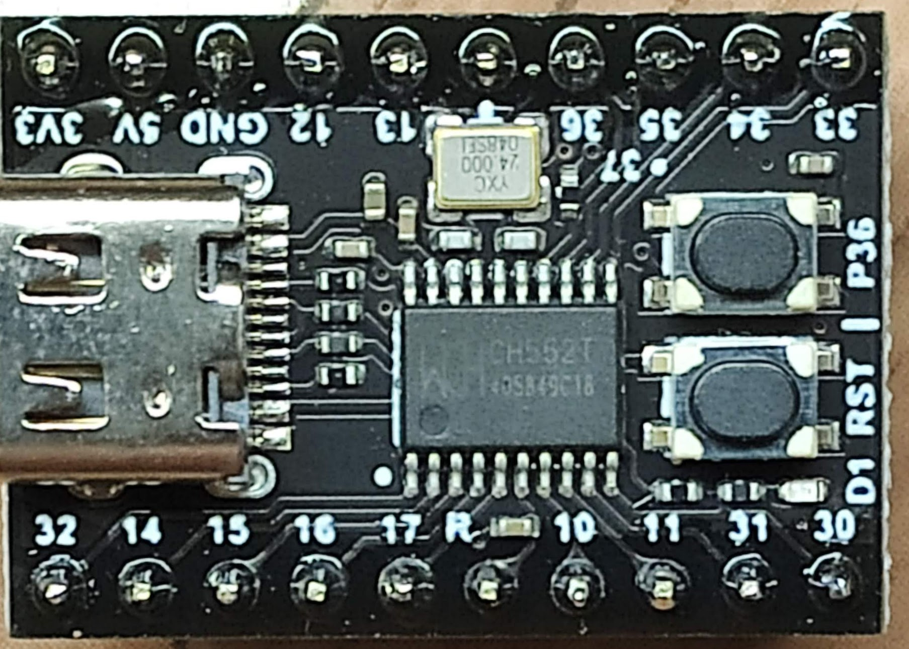

# ch552

попалась как то мне devboard от WeAct на мк ch552t,
  

CH552 is an enhanced E8051 core MCU compatible with MCS51 instruction set. 79% of its instructions
are single-byte single-cycle instructions, and the average instruction speed is 8 ~ 15 times faster than that
of the standard MCS51.

CH552 supports the maximum 24MHz system dominant frequency, with built-in 16K program memory
ROM and 256-byte internal iRAM and 1K-byte internal xRAM. xRAM supports DMA direct memory
access.

CH552 has built-in ADC analog-digital conversion, touch key capacitance detection, 3 sets of timers and
signal capture and PWM, double UARTs, SPI, USB device controller and full-speed transceiver and other
functional modules.

~~~
======================================================================================

Features
Core: Enhanced E8051 core compatible with MCS51 command set, 79% of its commands are
	single-byte single-cycle commands, and the average command speed is 8 ~ 15 times faster than that
	of the standard MCS51, with special XRAM data fast copy command, and double DPTR pointer.

Clock: Built-in 24MHz clock source, which can support external crystals by multiplexing GPIO pins.

ROM: Non-volatile memory ROM that can be programmed for many times, with the capacity of
	16KB, can all be used for program storage. Or it can be divided into a 14KB program storage area and
	a 2KB BootLoader/ISP program area.
        (заявлено 200 циклов записи)

DataFlash: 128-byte non-volatile data memory that can be erased for multiple times and supports
	rewrite data in unit of byte.
        (заявлено 10 тысяч циклов записи)

RAM: 256-byte internal iRAM, which can be used for fast temporary storage of data and stack. 1KB
	on-chip xRAM, which can be used for temporary storage of large amount of data and DMA direct
	memory access.
        (из 2-х регионов iRAM 256B + xRAM 1KB)

USB: Built-in USB controller and USB transceiver, support USB-Device mode, support USB type-C
	master-slave detection, support USB 2.0 full speed 12Mbps or low speed 1.5Mbps. Support data
	packet of up to 64 bytes, built-in FIFO, and support DMA.

Timer: 3 sets of timers, T0/T1/T2 is the standard MCS51 timer.

Capture: Timer T2 is extended to support 2-channel signal capture.

PWM: 2 sets of PWM output, PWM1/PWM2 is 2-channel 8-bit PWM output.

UART: 2 sets of UARTs. Both support higher communication baud rate. UART0 is a standard MCS51
	serial port.

SPI: The SPI controller has built-in FIFO, and the clock frequency can reach half of the system
	dominant frequency Fsys. It supports simplex multiplex of serial data input and output, and
	Master/Slave mode.

ADC: 4-channel 8-bit A/D converter. It supports voltage comparison.

Touch-key: 6-channel capacitance detection. It supports up to 15 touchkeys, and supports independent
	timing interrupt.

GPIO: It supports up to 17 GPIO pins (including XI/XO and RST as well as USB signal pins).

Interrupt: It supports 14 sets of interrupt signal sources, including 6 sets of interrupts compatible with
	the standard MCS51 (INT0, T0, INT1, T1, UART0, T2), and 8 sets of extended interrupts (SPI0,
	TKEY, USB, ADC, UART1, PWMX, GPIO, WDOG). And GPIO interrupt can be selected from 7
	pins.

Watch-Dog: 8-bit presettable watchdog timer WDOG, support timing interrupt.

Reset: It supports 4 kinds of reset signal sources, built-in power on reset, supports software reset,
	watchdog overflow reset and optional pin external input reset.

Power: Built-in 5V to 3.3V low dropout voltage regulator. It supports 5V or 3.3V or even 2.8V supply
	voltage. Support low-power sleep mode and external wake-up of USB, UART0, UART1, SPI0 and
	part of GPIOs.

Unique built-in ID number of chip.
======================================================================================

на Али, брал вот с такой цоколёвкой(pinout):

 MK = ch552t        TSSOP20:
   -------------------------------------------------------
1  P3.2/TXD1_/INT0/VBUS1/AIN3			       V33 20
2  P1.4/T2_/CAP1_/SCS/TIN2/UCC1/AIN1		   VCC/VDD 19
3  P1.5/MOSI/PWM1/TIN3/UCC2/AIN2	     	   GND/VSS 18
4  P1.6/MISO/RXD1/TIN4			      P1.2/XI/RXD_ 17
5  P1.7/SCK/TXD1/TIN5			      P1.3/XO/TXD_ 16
6  RST/T2EX_/CAP2_				  P3.7/UDM 15
7  P1.0/T2/CAP1/TIN0				  P3.6/UDP 14
8  P1.1/T2EX/CAP2/TIN1/VBUS2/AIN0		   P3.5/T1 13
9  P3.1/PWM2_/TXD			P3.4/PWM2/RXD1_/T0 12
10 P3.0/PWM1_/RXD				 P3.3/INT1 11
   -------------------------------------------------------

~~~

enverument fedora linux 27
~~~

1.install flasher & sdcc

$ dnf install sdcc python3-pip

$ python3 -mpip install ch55xtool

2.add path

export PATH=$PATH:/usr/libexec/sdcc

к примеру, добавить в файл .bash_profile

PATH=$PATH:$HOME/.local/bin:/usr/libexec/sdcc:$HOME/bin

export PATH

3.подключаем МК к компу, например через USB удерживая кнопку "boot"

5.очистка-сборка-заливка,
  во время заливки, 

$ make clean
$ make
 ? $ make flash ?

про компилятор sdcc на сайте http://sdcc.sourceforge.net
http://sdcc.sourceforge.net/doc/sdccman.pdf
~~~

PS:
 отличный пример использования
 https://github.com/MoonFox2006/USBLCD.git

платка от WeAct
 https://github.com/WeActStudio/WeActStudio.CH552CoreBoard.git
 пример для SDCC 
       SDK/03-SDCCExample

в 
 https://github.com/vdudouyt/penguinwire.git
есть инструкция по установке tools и пример для использования usb
 $ apt-get install sdcc python3-pip
 $ python3 -mpip install ch55xtool

