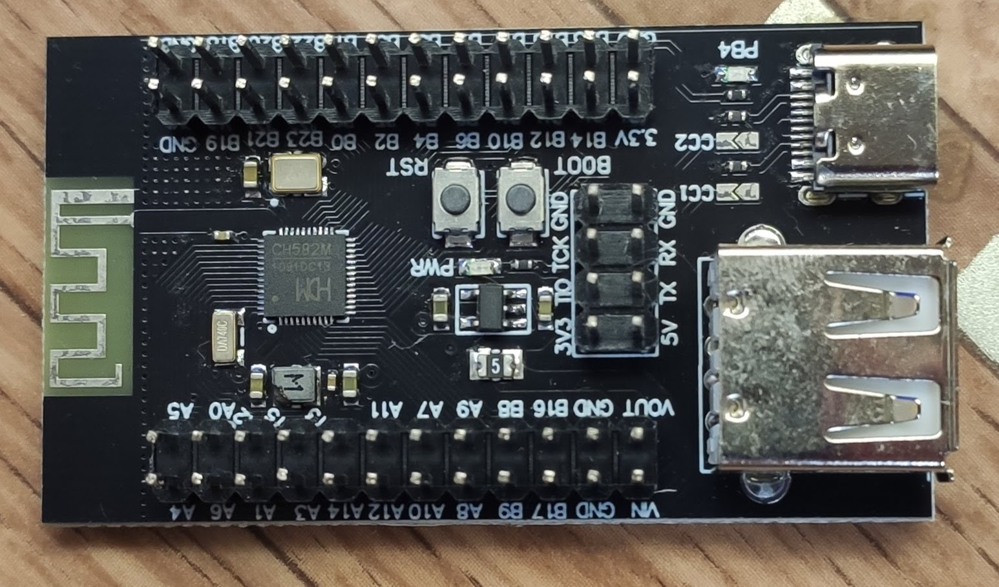
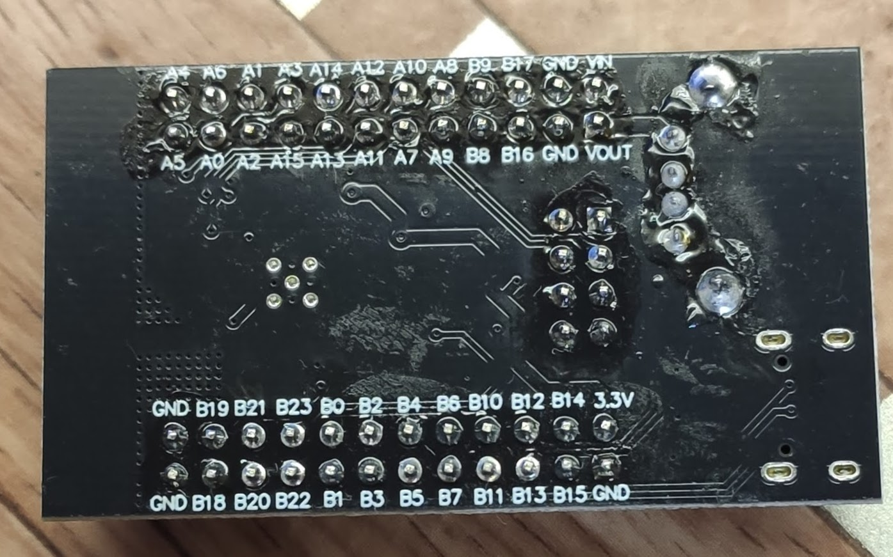

ch582m

  

The CH583 is a RISC-V MCU integrated with BLE wireless communication. It integrates 2Mbps Bluetooth Low
Energy communication module, 2 full-speed USB host and device controllers and transceiver, 2 SPIs, 4 UARTs,
14-channel ADC, touch-key detection module, RTC and other peripheral resources.

Features
core:
- 32-bit QingKe RISC-V processor WCH RISC-V4A
- Support RV32IMAC instruction set, hardware multiplication and division
- Low-power 2-stage assembly line, high-performance 1.56DMIPS
- Multi-speed system frequency: minimum 32 KHz  (максимум вроде до 80MHz, хотя обычно пишут 60MHz)
- Unique high-speed interrupt response mechanism

512K-byte non-volatile memory FlashROM:
- 448KB user application program memory area CodeFlash
- 32KB user non-volatile data memory area DataFlash (EEPROM ?)
- 24KB system boot program memory area BootLoader
- 8KB system non-volatile configuration information memory area InfoFlash
- Support ICP, ISP and IAP, support OTA wireless upgrade
- Basically, zero-wait at the system frequency of 20MHz

32K-byte volatile data storage SRAM:
- Sleep retention memory area RAM30K using 30KB dual power supply
- Sleep retention memory area RAM2K using 2KB dual power supply

Power management and low power:
- Support 3.3V and 2.5V power, CH583M supports 1.8V
- Built-in DC-DC conversion, reducing power consumption
- Idle mode: 1.6mA
- Halt mode: 320uA
- Sleep mode: Multiple gears from 0.7uA to 2.8uA
- Shutdown mode: Multiple gears from 0.2uA to 2.3uA
- Optional low-voltage monitoring of low-power or
- high-precision battery voltage

Security properties:
- AES-128 encryption and decryption, unique chip ID

Bluetooth Low Energy (BLE):
- Integrated with 2.4GHz RF transceiver and baseband and link control
- -98dBm RX sensitivity, programmable +6dBm TX power
- BLE complies with Bluetooth Low Energy Specification 5.0
- Support 2Mbps, 1Mbps, 500Kbps and 125Kbps
- The wireless communication distance is about 500 meters at 6dBm TX power
- The communication distance is about 1000 meters at the TX power of 6dBm and 125Kbps
- Provide optimized protocol stack and application layer API, and support networking

Real-time clock (RTC):
- 2 modes of timing and triggering

Universal serial bus (USB):
- 2 sets of independent USB controller and transceiver
- 15 endpoints, support DMA, support 64-byte data packet
- Integrated USB 2.0 full-speed transceiver PHY, no peripheral required
- Support host and device mode at full-speed/low-speed

Analog to digital converter (ADC):
- 12-bit analog to digital converter, support differential and single-ended input
- 14 external analog signal channels and 2 internal signal channels

Touchkey detection module (TouchKey):
- 14-channel

Timer and pulse width modulation (PWM):
- 4 sets of 26-bit timers, which can reach 4.2S at the frequency of 16MHz
- 4-channel capture/sample, support rising edge/falling edge /double edge
- 4-channel 26-bit PWM output, 8-channel 8-bit PWM output

Universal asynchronous receiver/transmitter (UART):
- 4 independent UARTs, compatible with 16C550,built-in 8-level FIFO
- 23-bit counter, up to 6Mbps communication baud rate
- UART0 supports some modems, supports hardware automatic flow control
- UART0 supports automatic matching of slave address during multi-device communication

Serial peripheral interface (SPI):
- 2 sets of independent SPIs, built-in FIFO
- SCK serial clock frequency can reach half of system clock frequency
- SPI0 supports Master and Slave modes, DMA capability

2-wire serial interface (I2C):
- Support Master and Slave modes, compatible with SMBus
- Support 7-bit or 10-bit address and bus broadcast
- Support arbitration, error detection, PEC check and clock extension

Temperature sensor (TS)

Clock: Built-in PLL, built-in 32KHz clock

General purpose input/output (GPIO):
- 40 GPIOs, 2 of them support 5V signal input
- Optional pull-up or pull-down resistor, optional output drive capability
- 32 GPIOs support level or edge interrupt input
- 32 GPIOs support level or edge wake-up input

Package: QFN48_5X5, QFN28_4X4

Compared with CH582, CH583 adds SPI1 master and supports power supply down to 1.7V. CH581 is a simplified
chip of CH582, with 1 set of USB, touch-key detection module, I2C module and 2 UARTs removed. The FlashROM
of CH581 is only 256KB, and the ADC of CH581 does not support DMA. The others of CH581 are the same as
that of CH582, please refer to CH582 datasheet and resources directly.

-------------------------------------------------
https://github.com/openwch/ch583.git

-------------------------------------------------

~~~
connect to
ch582m   WCH-LinkE
------  ------ 
        swdio
        swclk
        NRST
3.3     3V3
GND     GND    
------  ------ 

~~~

