project UTFT

главный источник: 
http://www.rinkydinkelectronics.com/library.php?id=51

-----------------------------

board HLK-W801-KIT-V1.1 + 3.2 TFT дисплей Ultra HD 320X480 HX8367C 16bit bus

Видео
https://youtu.be/ULZDZhmtduk

[3.2 TFT дисплей Ultra HD 320X480 HX8367C 16bit bus](https://rutube.ru/video/838e6cfcbbca392da33edcaa4634499d/?r=wd)

Дисплей
фото 1 
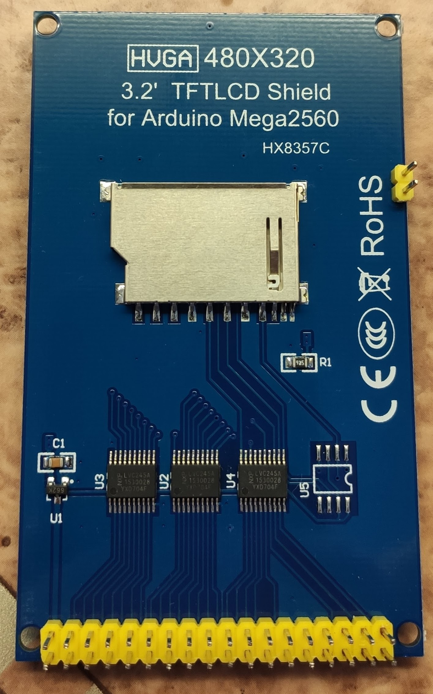
фото2
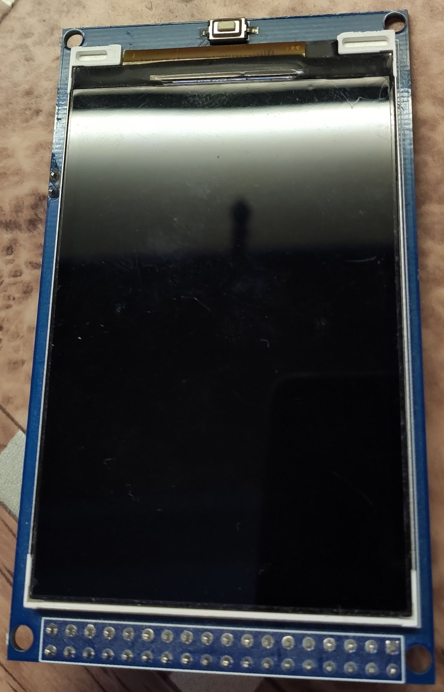

для него тест (main.c) лежит в директории 01_UTFU/app/test/TFT32MEGA_2 

соединения

надо соединить по схеме:
~~~
на LCD если смотреть сверху на экран, и разьем с правой стороны
то, соединения такие
connect to TFT32MEGA_2 
---- --------- ----
W801 LCD   LCD W801
---- --------- ----
5v    5v   5v	
PB17 VH0   VH1 PB18
PB26 VH2   VH3 PB25 
PB24 VH4   VH5 PB23 
PB22 VH6   VH7 PB21 
PB16 VL7   VL6 PB01
PB27 VL5   VL4 PB15 
PB14 VL3   VL2 PB13 
PB12 VL1   VL0 PB00
PA01 RS	    WR PA02	
PA03 CS    RST PA04
     -*-   -*-
     -*-   RD
     -*-   -*-
     -*-   -*-
 MISO SD   SD MOSI
  SCK SD   SD CS
gnd  GND   GND
---- --------- ----
W801 LCD   LCD W801
---- --------- ----

*подготовка изображений для SD Card (инф.ниже)
# convert *.jpg -resize 480x320! -rotate 180 -define bmp:subtype=RGB565 j%03d-480x320.bmp

если используется библиотека libTJPEG.a
# convert *.jpg -resize 480x320! j%03d-480x320.jpg

~~~

------------------------------------------------

board HLK-W801-KIT-V1.1 + 0.96 TFT 80x160 дисплей st7735s SPI

Видео
https://youtu.be/RTD7CE0EDUw

[0.96 TFT 80x160 (начало ролика)](https://rutube.ru/video/ec465c24d1d1ead0105c849e8e884040/?r=wd&t=3)

Дисплей
фото 1 

фото2
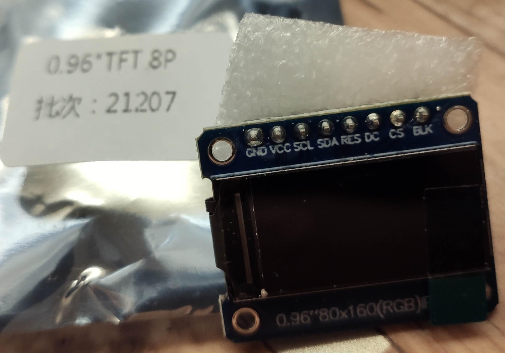

для него тест (main.c) лежит в директории 01_UTFU/app/test/TFT00_96SP

соединения

надо соединить по схеме:
~~~
connect to TFT00_96SP SPI
---- ------
W801 LCD   
---- ------
gnd  GND  
3.3v VCC
PB15 SCL  синхросигнал
PB17 SDA  данные
PB21 RES  сброс (reset)
PB23 DC   комманда/данные
PB14 CS   выбор чипа
---  BLK  подсветка, можно через PWM, в данном случае не использовал
---- ------
W801 LCD   
---- ------

*подготовка изображений для SD Card (инф.ниже)
# convert *.jpg -resize 160x80! -rotate 180 -define bmp:subtype=RGB565 j%03d-160x80.bmp

если используется библиотека libTJPEG.a
# convert *.jpg -resize 160x80! j%03d-160x80.jpg

~~~

------------------------------------------------

board HLK-W801-KIT-V1.1 + 1.3 TFT 240x240 дисплей st7789 SPI

Видео
https://youtu.be/RTD7CE0EDUw?t=93

[1.3 TFT 240x240](https://rutube.ru/video/ec465c24d1d1ead0105c849e8e884040/?r=wd&t=32)

Дисплей
фото 1 
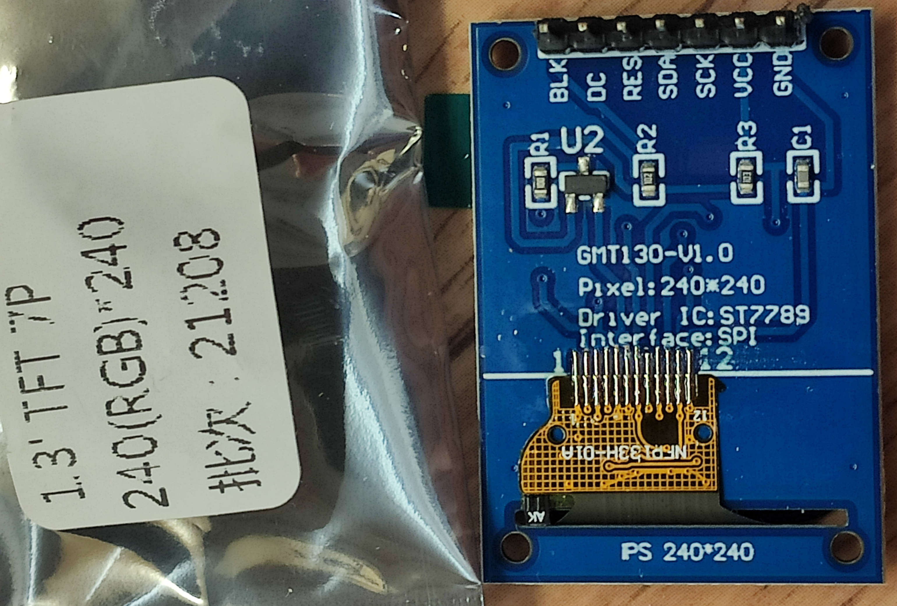
фото2
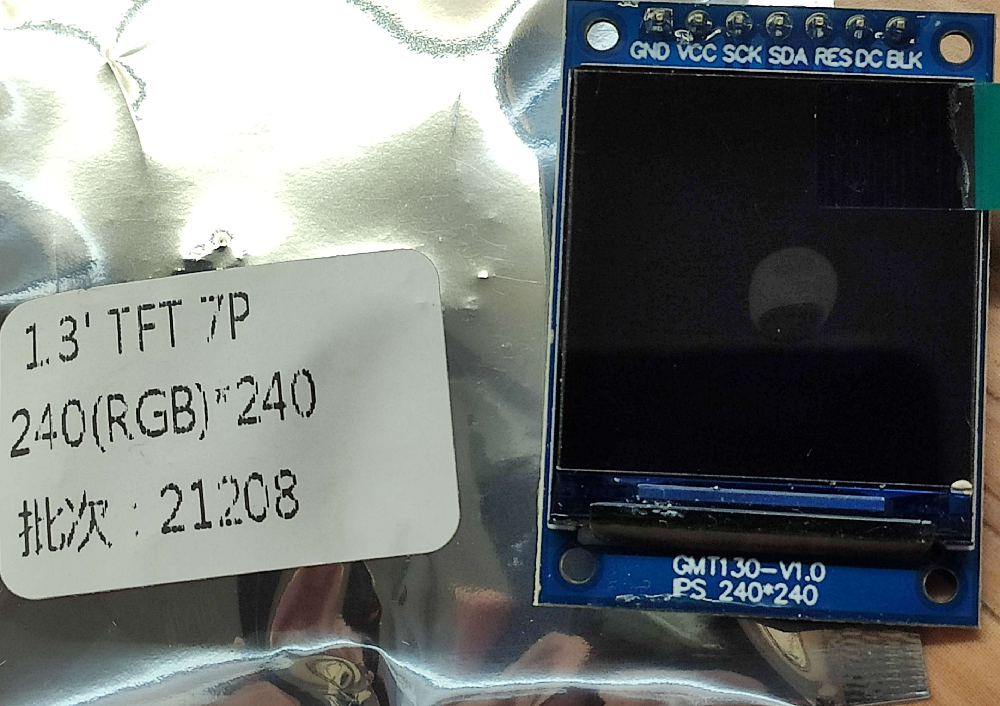

для него тест (main.c) лежит в директории 01_UTFU/app/test/TFT1_3SP

соединения

надо соединить по схеме:
~~~
connect to TFT1_3SP SPI
---- ------
W801 LCD   
---- ------
gnd  GND  
3.3v VCC
PB15 SCL  синхросигнал
PB17 SDA  данные
PB21 RES  сброс (reset)
PB23 DC   комманда/данные
---  BLK  подсветка, можно через PWM, в данном случае не использовал
---- ------
W801 LCD   
---- ------

*подготовка изображений для SD Card (инф.ниже)
# convert *.jpg -resize 240x240! -rotate 180 -define bmp:subtype=RGB565 j%03d-240x240.bmp

если используется библиотека libTJPEG.a
# convert *.jpg -resize 240x240! j%03d-240x240.jpg

~~~

------------------------------------------------

board HLK-W801-KIT-V1.1 + 1.14 TFT 135x240 дисплей st7789v SPI

Видео

Дисплей
фото 1 
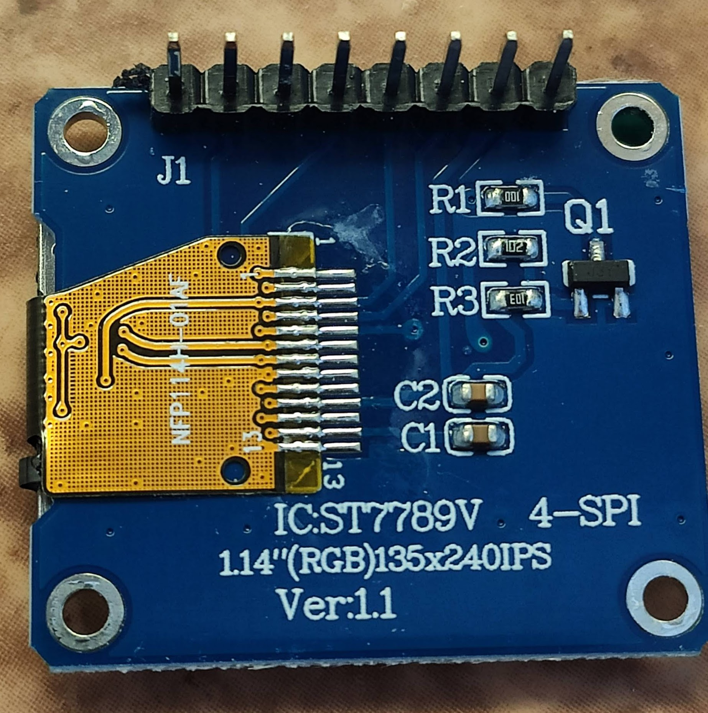
фото2
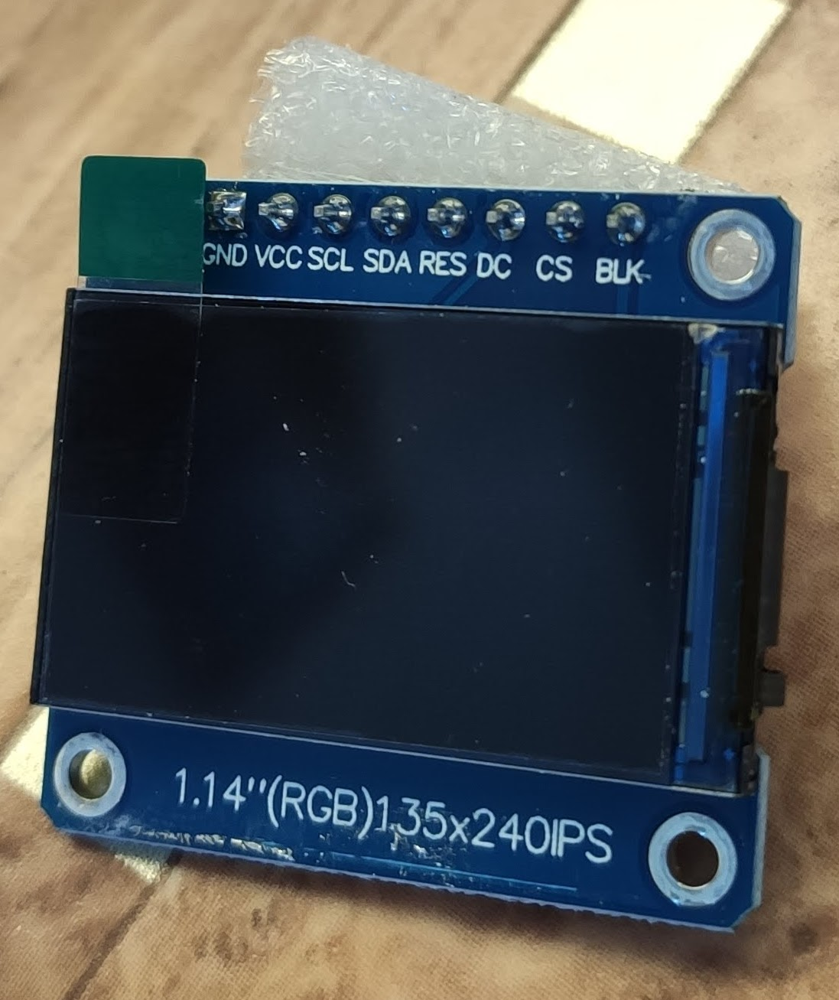

для него тест (main.c) лежит в директории 01_UTFU/app/test/TFT01_14V89

соединения

надо соединить по схеме:
~~~
connect to TFT01_14V89 SPI
---- ------
W801 LCD   
---- ------
gnd  GND  
3.3v VCC
PB15 SCL  синхросигнал
PB17 SDA  данные
PB21 RES  сброс (reset)
PB23 DC   комманда/данные
PB14 CS   выбор чипа
---  BLK  подсветка, можно через PWM, в данном случае не использовал
---- ------
W801 LCD   
---- ------

*подготовка изображений для SD Card (инф.ниже)
# convert *.jpg -resize 240x135! -rotate 180 -define bmp:subtype=RGB565 j%03d-240x135.bmp

если используется библиотека libTJPEG.a
# convert *.jpg -resize 240x135! j%03d-240x135.jpg

~~~

------------------------------------------------

board HLK-W801-KIT-V1.1 + 1.47 TFT 172x320 дисплей st7789v3 SPI

Видео

Дисплей
фото 1 
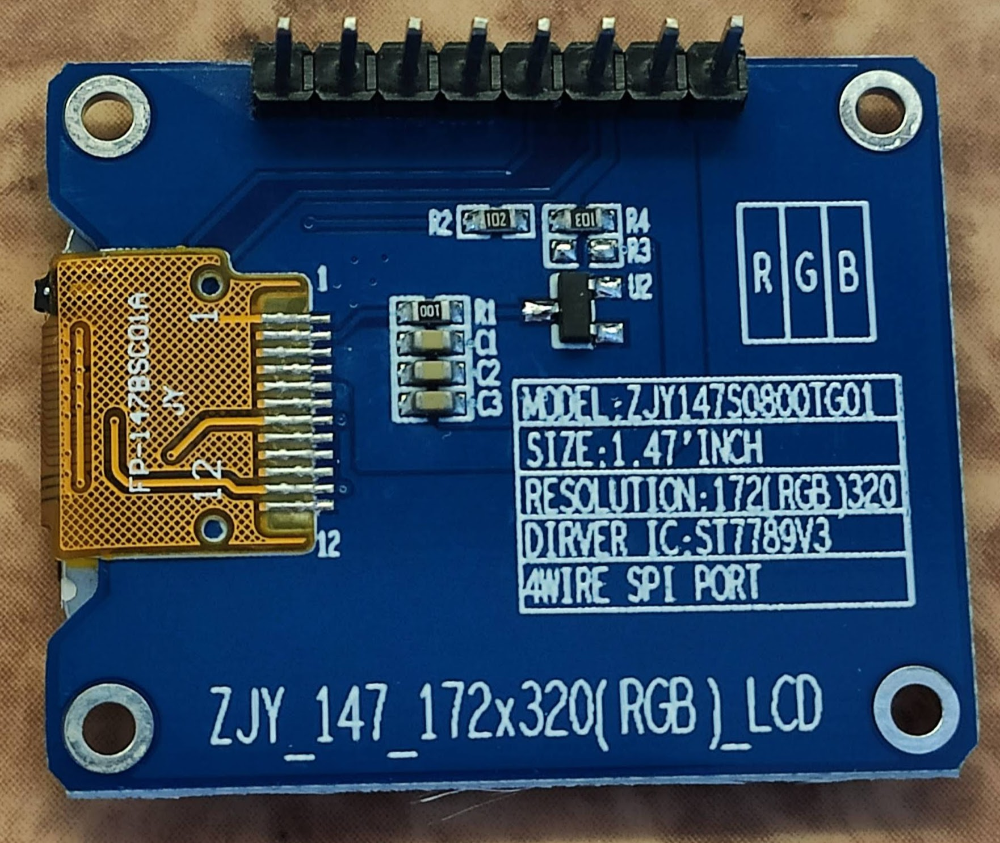
фото2
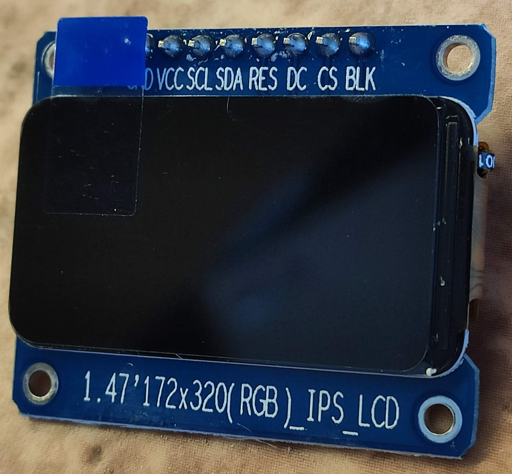

для него тест (main.c) лежит в директории 01_UTFU/app/test/TFT01_47V89

соединения

надо соединить по схеме:
~~~
connect to TFT01_47V89 SPI
---- ------
W801 LCD   
---- ------
gnd  GND  
3.3v VCC
PB15 SCL  синхросигнал
PB17 SDA  данные
PB21 RES  сброс (reset)
PB23 DC   комманда/данные
PB14 CS   выбор чипа
---  BLK  подсветка, можно через PWM, в данном случае не использовал
---- ------
W801 LCD   
---- ------

*подготовка изображений для SD Card (инф.ниже)
# convert *.jpg -resize 320x172! -rotate 180 -define bmp:subtype=RGB565 j%03d-320x172.bmp

если используется библиотека libTJPEG.a
# convert *.jpg -resize 320x172! j%03d-320x172.jpg

~~~

------------------------------------------------

------------------------------------------------

board HLK-W801-KIT-V1.1 + 1.69 TFT 240x280 дисплей st7789v2 SPI

Видео

Дисплей
фото 1 
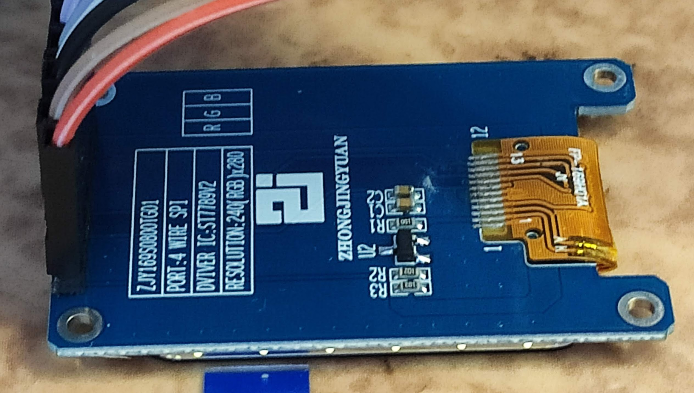
фото2
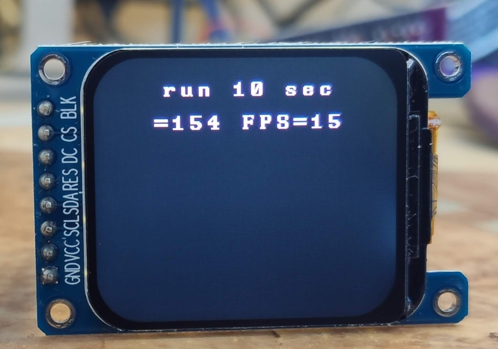

для него тест (main.c) лежит в директории 01_UTFU/app/test/TFT01_69V89

соединения

надо соединить по схеме:
~~~
connect to TFT01_69V89 SPI
---- ------
W801 LCD   
---- ------
gnd  GND  
3.3v VCC
PB15 SCL  синхросигнал
PB17 SDA  данные
PB21 RES  сброс (reset)
PB23 DC   комманда/данные
PB14 CS   выбор чипа
---  BLK  подсветка, можно через PWM, в данном случае не использовал
---- ------
W801 LCD   
---- ------

*подготовка изображений для SD Card (инф.ниже)
# convert *.jpg -resize 280x240! -rotate 180 -define bmp:subtype=RGB565 j%03d-280x240.bmp

если используется библиотека libTJPEG.a
# convert *.jpg -resize 280x240! j%03d-280x240.jpg

~~~

------------------------------------------------

-----------------------------

board HLK-W801-KIT-V1.1 + 3.2 TFT дисплей 320X240 16bit bus

Видео
https://youtu.be/Jpsm4nAKuIg

[3.2 TFT дисплей 320X240 16bit bus](https://rutube.ru/video/c71990fa424558939ec15a6e39cc9123/)

Дисплей
фото 1 
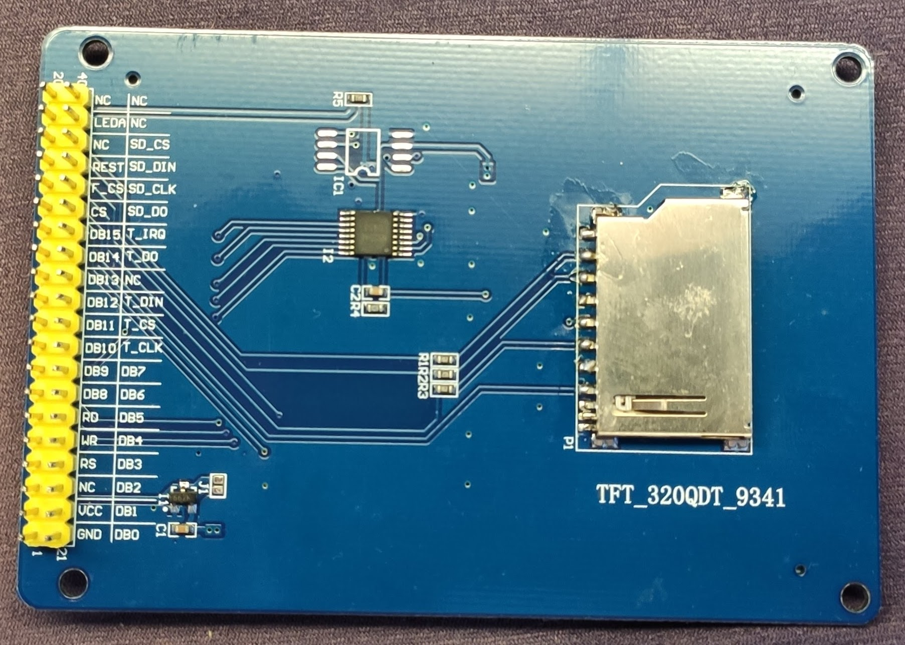
фото2

для него тест (main.c) лежит в директории 01_UTFU/app/test/TFT_320QDT_9341

соединения

надо соединить по схеме:
~~~
вид с низу, разьем слева
connect to TFT_320QDT_9341
---- ------------ ----
W801 LCD   LCD    W801
---- ------------ ----
       20  40
       NC  NC
3.3v LEDA  NC
       NC  SD_CS
PA04 REST  SD_DIN
     F_CS  SD_CLK
PA03   CS  SD_DO
PB21 DB15  T_IRQ
PB22 DB14  T_DO
PB23 DB13  NC
PB24 DB12  T_DIN
PB25 DB11  T_CS
PB26 DB10  T_CLK
PB18  DB9  DB7    PB16
PB17  DB8  DB6    PB01
3.3v   RD  DB5    PB27
PA02   WR  DB4    PB15 
PA01   RS  DB3    PB14
       NC  DB2    PB13 
 
5V    VCC  DB1    PB12
gnd   GND  DBO    PB00
        1   21
---- ------------ ----
W801  LCD  LCD    W801
---- ------------ ----

*подготовка изображений для SD Card (инф.ниже)
# convert *.jpg -resize 320x240! -rotate 180 -define bmp:subtype=RGB565 j%03d-320x240.bmp

если используется библиотека libTJPEG.a
# convert *.jpg -resize 320x240! j%03d-320x240.jpg

~~~

------------------------------------------------

board HLK-W801-KIT-V1.1 + 2.4 TFT SPI 240x320 V1.3

Видео

Дисплей
фото 1 
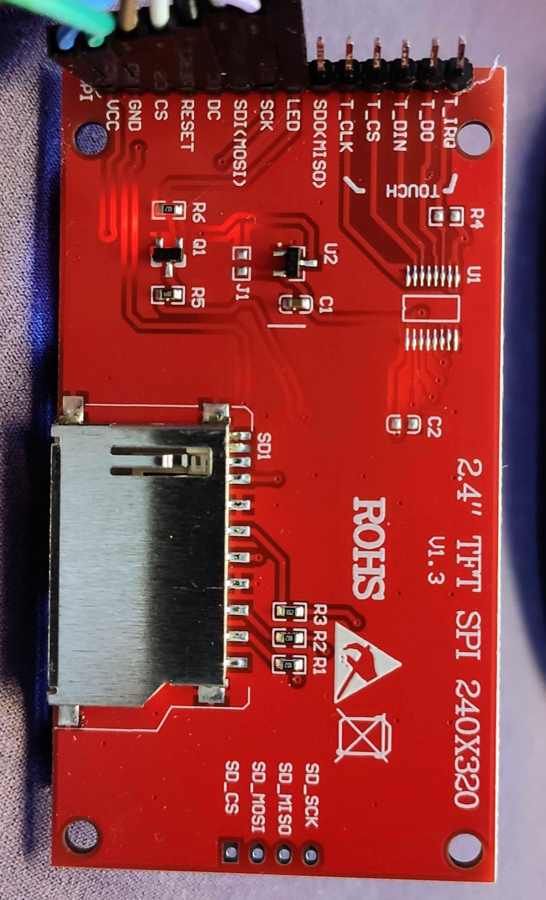
фото 2
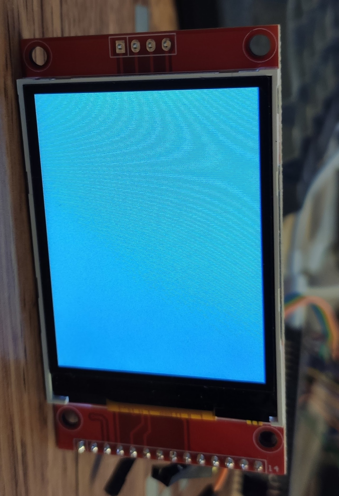

для него тест (main.c) лежит в директории 
01_UTFU/app/test/TFT2_4SP_9341

версия с использованием SDIO 
01_UTFU/app/test/TFT2_4SP_9341/spi_SDIO

соединения

для SPI надо соединить по схеме:
~~~
connect to TFT2_4SP_9341
---- ------
W801 LCD   
---- ------
3.3v VCC
gnd  GND  
PB21 RESET сброс
PB14 CS    выбор чипа
PB23 DC    комманда/данные
PB17 SDI   данные
PB15 SCK   синхросигнал
3.3v LED  
---- ------
W801 LCD   
---- ------

*подготовка изображений для SD Card (инф.ниже)
# convert *.jpg -resize 320x240! -rotate 180 -define bmp:subtype=RGB565 j%03d-320x240.bmp

если используется библиотека libTJPEG.a
# convert *.jpg -resize 320x240! j%03d-320x240.jpg

~~~

для SDIO надо соединить по схеме:
~~~
connect to TFT2_4SP_9341
---- ------
W801 LCD   
---- ------             
3.3v VCC                  
gnd  GND                  
PB21 RESET сброс          
PB23 CS    выбор чипа     
PB22 DC    комманда/данные
PB07 SDI   данные         
PB06 SCK   синхросигнал   
3.3v LED  
---- ------
W801 LCD   
---- ------

в результате тут нельзя подключить SD карту, интерфейс SDIO занят (его надо переделывать на SPI)
~~~

------------------------------------------------

board HLK-W801-KIT-V1.1 + 3.2 TFT SPI 240x320 V1.0

Видео

Дисплей
фото 1 
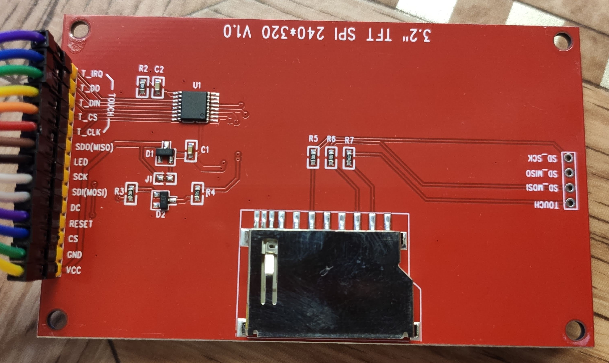
фото 2
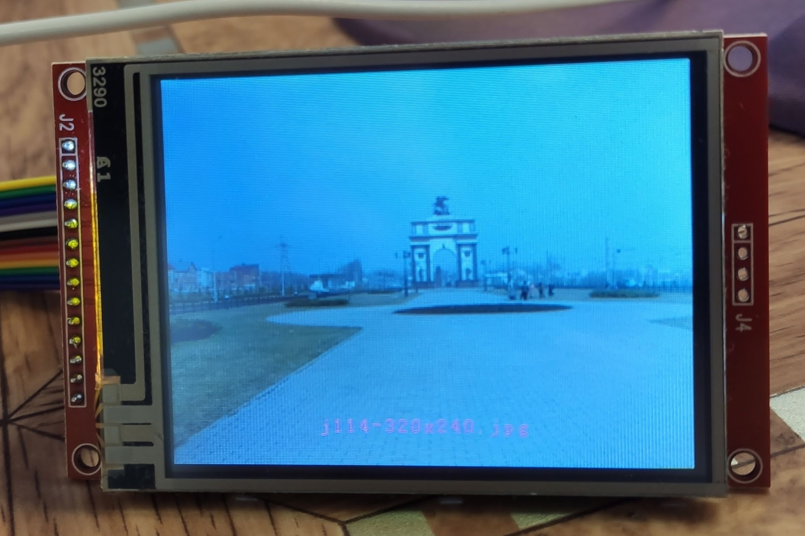

для него тест (main.c) лежит в директории 01_UTFU/app/test/TFT3_2SP_9341

соединения

надо соединить по схеме:
~~~
connect to TFT3_2SP_9341
---- ------
W801  LCD   
---- ------
      T_IRQ
      T_DO
      T_DIN
      T_CS
      T_CLK
PB16  SDO(MISO)
3.3v  LED
PB15  SCK         синхросигнал
PB17  SDI(MOSI)
PB23  DC          комманда/данные
PB21  RESET       сброс
PB14  CS          выбор чипа
gnd   GND
3.3v  VCC
---- ------
W801  LCD   
---- ------

*подготовка изображений для SD Card (инф.ниже)
# convert *.jpg -resize 320x240! -rotate 180 -define bmp:subtype=RGB565 j%03d-320x240.bmp

если используется библиотека libTJPEG.a
# convert *.jpg -resize 320x240! j%03d-320x240.jpg

~~~

--------------------------------------------------

------------------------------------------------

board HLK-W801-KIT-V1.1 + 2.0 TFT SPI 240x320 

по углам обзора - похоже на IPS

Видео
https://youtu.be/fxX3JLcDdj8

[2.0 TFT SPI 240x320](https://rutube.ru/video/20d39b3309229190c4d08950b38cac4d/)

Дисплей
фото 1 
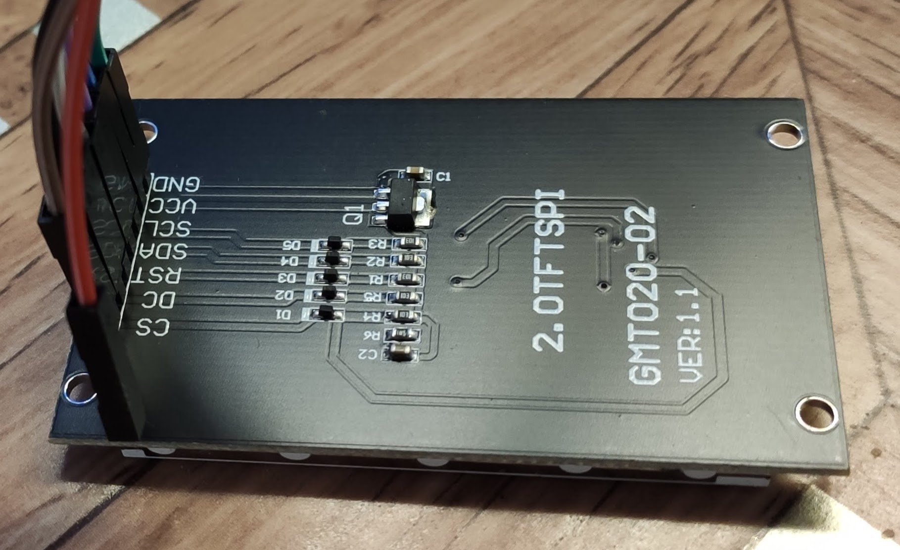
фото 2
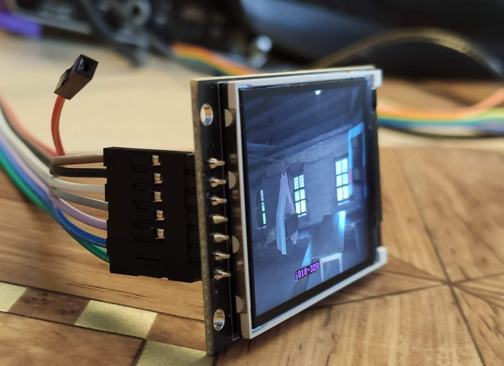

для него тест (main.c) лежит в директории 01_UTFU/app/test/TFT02_0V89 
для SDIO 01_UTFU/app/test/TFT02_0V89/SDIO

соединения

надо соединить по схеме:
~~~
connect to TFT02_0V89 
---- ------
W801 LCD   
---- ------
gnd  GND  
3.3v VCC
PB15 SCL  синхросигнал
PB17 SDA  данные
PB21 RES  сброс (reset)
PB23 DC   команда/данные
PB14 CS   выбор чипа
---- ------
W801 LCD   
---- ------

версия с использованием SDIO (60 Mhz) 
для SDIO надо соединить по схеме:
connect to TFT02_0V89 
---- ------
W801 LCD   
---- ------
gnd  GND  
3.3v VCC
PB06 SCL  синхросигнал
PB07 SDA  данные
PB21 RES  сброс (reset)
PB22 DC   команда/данные
PB14 CS   выбор чипа
---- ------
W801 LCD   
---- ------

*подготовка изображений для SD Card (инф.ниже)
# convert *.jpg -resize 320x240! -rotate 180 -define bmp:subtype=RGB565 j%03d-320x240.bmp

если используется библиотека libTJPEG.a
# convert *.jpg -resize 320x240! j%03d-320x240.jpg

~~~

------------------------------------------------

------------------------------------------------

board HLK-W801-KIT-V1.1 + 1.8 TFT SPI 128x160  1'8 tft 128*rgb*160 ver 1.0

Видео

Дисплей
фото 1 
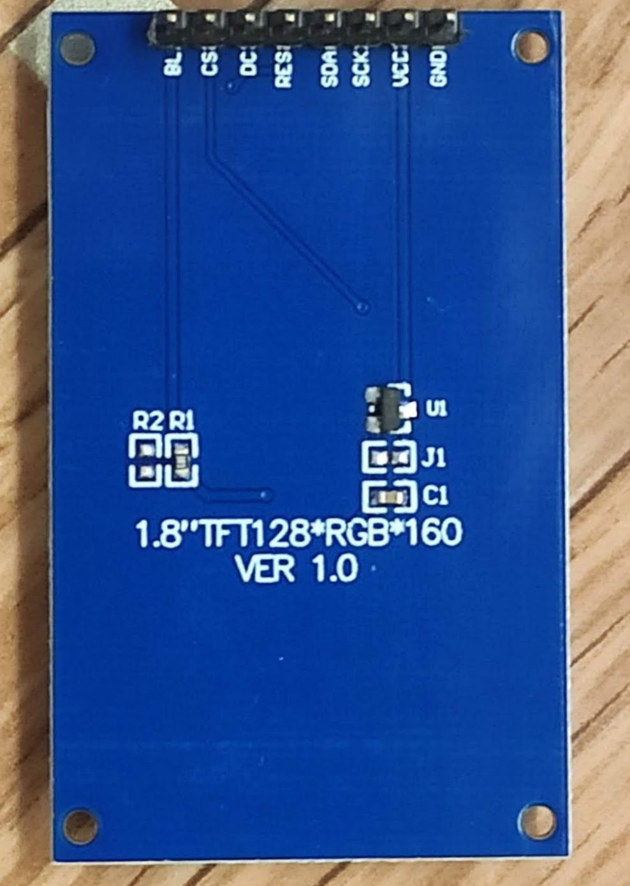
фото 2
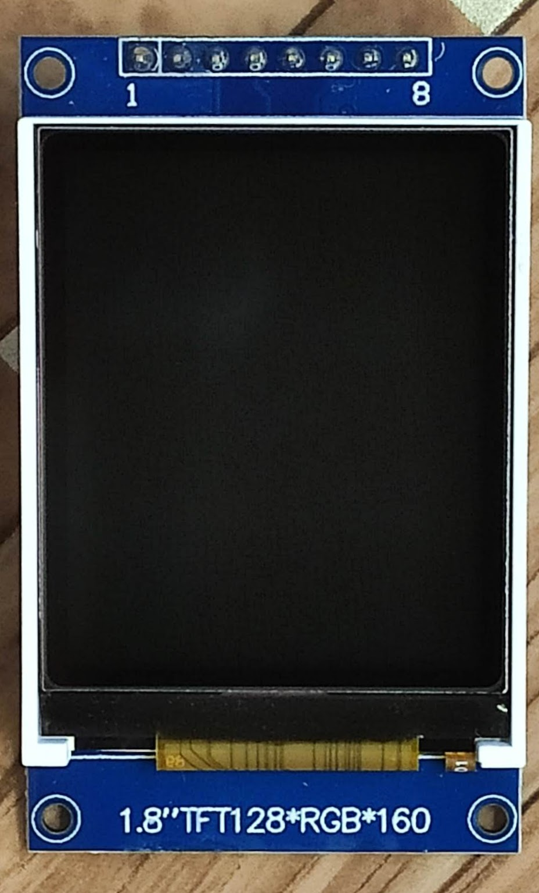

для него тест (main.c) лежит в директории 01_UTFU/app/test/TFT01_18SP

соединения

надо соединить по схеме:
~~~
connect to TFT01_18SP
---- ------
W801 LCD   
---- ------
gnd  GND  
3.3v VCC
PB15 SCL  синхросигнал
PB17 SDA  данные
PB21 RES  сброс (reset)
PB23 DC   команда/данные
PB14 CS   выбор чипа
3.3v BLK  подсветка, (можно через PWM)
---- ------
W801 LCD   
---- ------

или в ражиме SDIO
---- ------
W801 LCD   
---- ------             
3.3v bl    подсветка 
3.3v vcc
gnd  gnd
PB21 res   RESET сброс           
PB23 cs    CS выбор чипа       
PB22 dc    комманда/данные  
PB07 sda   данные           
PB06 sck   синхросигнал     
---- ------
W801 LCD   
---- ------

*подготовка изображений для SD Card (инф.ниже)
# convert *.jpg -resize 160x128! -rotate 180 -define bmp:subtype=RGB565 j%03d-160x128.bmp

если используется библиотека libTJPEG.a
# convert *.jpg -resize 160x128! j%03d-160x128.jpg

~~~

-----------------------------

board HLK-W801-KIT-V1.1 + 3.97 TFT_397T_NT35510 800x480 16bit bus

по углам обзора - похоже на IPS

wiki
http://www.lcdwiki.com/3.97inch_16BIT_Module_NT35510_SKU:MRB3973

бывают еще очень похожие дисплеи, но с другим драйвером, 
http://www.lcdwiki.com/3.97inch_16BIT_Module_OTM8009A_SKU:MRB3971
с драйвером от NT35510 - работать не будет.

Видео
https://youtu.be/OAJxVA2hCOE

[3.97 TFT_397T_NT35510 800x480 16bit bus](https://rutube.ru/video/e25bac8202becb40c301e229cf2b42e4/)

Дисплей
фото 1 
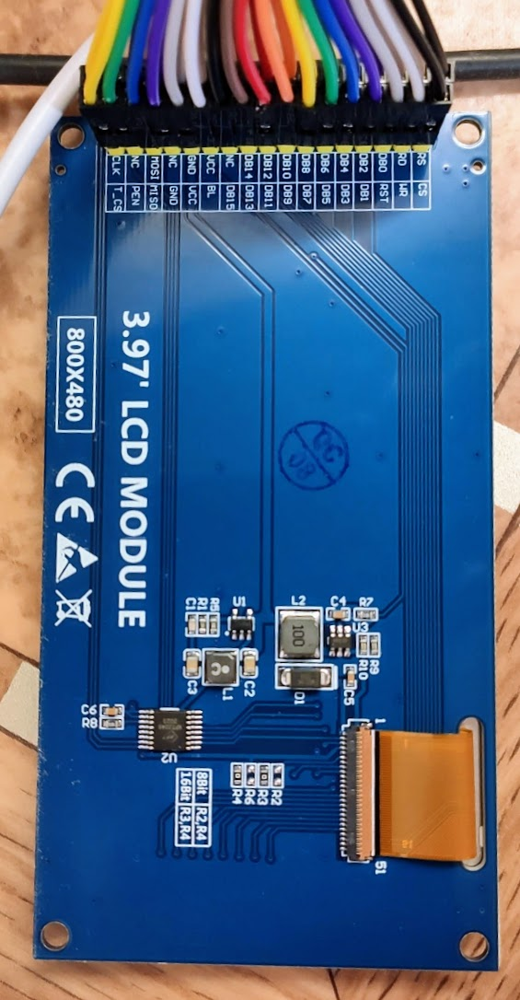
фото 2
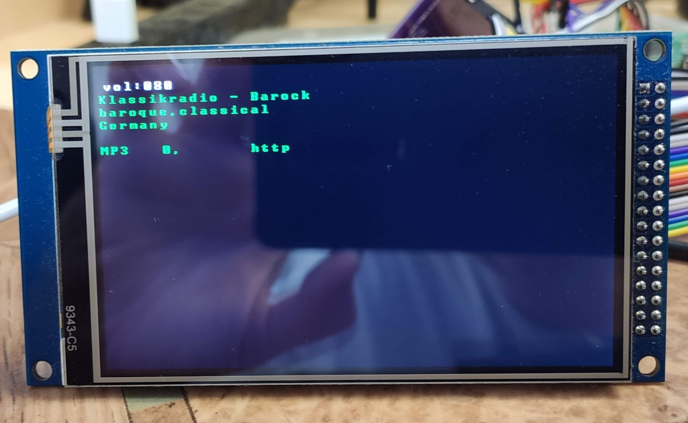

wiki
http://www.lcdwiki.com/3.97inch_16BIT_Module_NT35510_SKU:MRB3973

для него тест (main.c) лежит в директории 01_UTFU/app/test/TFT_397T_NT35510

соединения

надо соединить по схеме:
~~~
вид с низу, разъём слева
connect to TFT_397T_NT35510
---- ------------ ----
W801 LCD      LCD W801
---- ------------ ----
PA01 RS      CS   PA03
3.3v RD      WR   PA02
PB00 DBO     RST  PA04 
PB13 DB2     DB1  PB12
PB15 DB4     DB3  PB14
PB01 DB6     DB5  PB27
PB17 DB8     DB7  PB16
PB26 DB10    DB9  PB18
PB24 DB12    DB11 PB25
PB22 DB14    DB13 PB23
     NC      DB15 PB21
3.3v VCC       BL 3.3v 
gnd  GND      VCC 3.3v 
     NC       GND gnd 
PA07 MOSI    MISO PA08
     NC       PEN PA09
PA05 CLK     T_CS PA06
---- ------------ ----
W801 LCD      LCD W801
---- ------------ ----

*выводы PA05,PA06,PA07,PA08,PA09 используются для touchscreen, если он не используется, можно не подсоединять

*подготовка изображений для SD Card (инф.ниже)
# convert *.jpg -resize 800x480! -rotate 180 -define bmp:subtype=RGB565 j%03d-800x480.bmp

если используется библиотека libTJPEG.a
# convert *.jpg -resize 800x480! j%03d-800x480.jpg

* резисторы на плате переключают режимы
8bit  R2,R4 > 80-series 8-bit MPU interface, D[7:0]  - не пробовал

16bit R3,R4 > 80-series 16-bit MPU interface, D[15:0] - наш вариант

24bit R2,R4 > это не выведено на пины...

SPI   R3,R6 > 16-bit SPI, SDI/SDO serial data, SCL rising trigger, CS - chip select
  тогда получится:
-------------------------------------
|разьем LCD|шлейф дисплея 1-51| SPI |
-------------------------------------
|   CS     |   18             | CS  |
|   WR     |   16             | SCL |
|          |   14             | SDI | 
|          |   13             | SDO | 
|   RS     |   15             | DCX |? 
-------------------------------------
 вывод RS (Cmd/Data), используется ли в режиме SPI ?
 или может тут пакет с 9 битами, первый бит для обозначения 
  комманда/данные ?

~~~

------------------------------------------------

-----------------------------

board HLK-W801-KIT-V1.1 + 2.4inch 16BIT Module ILI9341 SKU:MRB2408 320x240 16bit bus

Видео

Дисплей
фото 1 
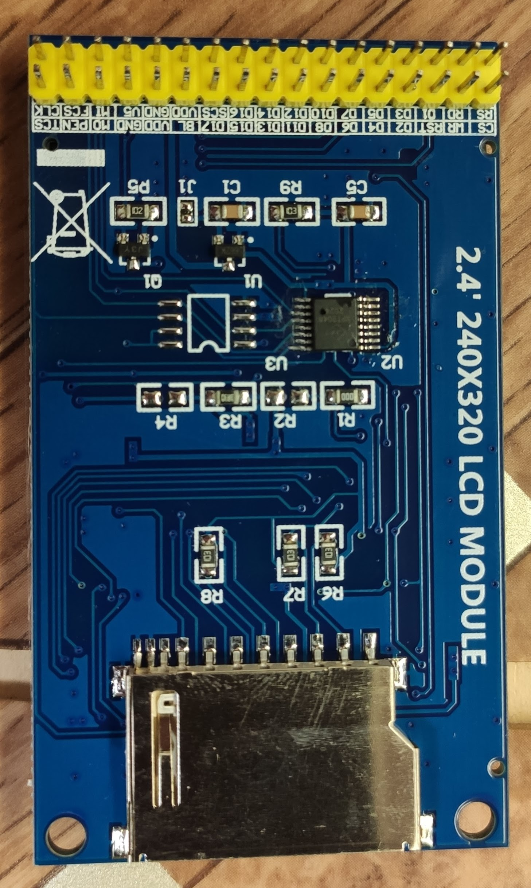
фото 2
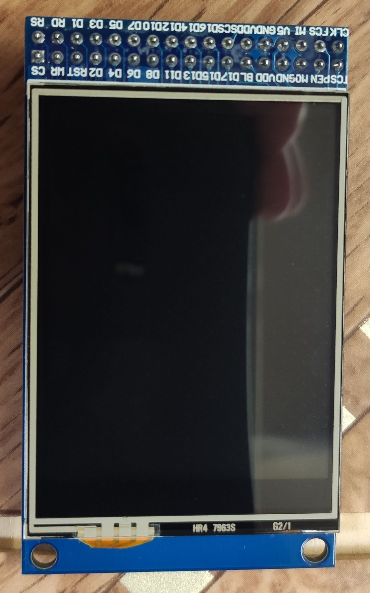

wiki
http://www.lcdwiki.com/2.4inch_16BIT_Module_ILI9341_SKU:MRB2408

для него тест (main.c) лежит в директории 01_UTFU/app/test/TFT_320QDT_9341

соединения

надо соединить по схеме:
~~~
вид с низу, разъём слева
connect to TFT_24_MRB2408
---- ------------ ----
W801 LCD     LCD  W801
---- ------------ ----
PA01 RS        CS PA03
3.3v RD        WR PA02
PB00 D1       RST PA04 
PB13 D3        D2 PB12
PB15 D5        D4 PB14
PB01 D7        D6 PB27
PB17 D10       D8 PB16
PB26 D12      D11 PB18
PB24 D14      D13 PB25
PB22 D16      D15 PB23
     SCS      D17 PB21
3.3v VDD       BL 3.3v 
gnd  GND      VDD 3.3v 
     5V       GND gnd 
PA07 MOSI    MISO PA08
     FCS      PEN PA09
PA05 CLK      TCS PA06
---- ------------ ----
W801 LCD      LCD W801
---- ------------ ----

*выводы PA05,PA06,PA07,PA08,PA09 используются для touchscreen (библиотека URTouch), если он не используется, можно не подсоединять

*подготовка изображений для SD Card (инф.ниже)
# convert *.jpg -resize 320x240! -rotate 180 -define bmp:subtype=RGB565 j%03d-320x240.bmp

если используется библиотека libTJPEG.a
# convert *.jpg -resize 320x240! j%03d-320x240.jpg

~~~

------------------------------------------------

------------------------------------------------

board HLK-W801-KIT-V1.1 + 3.5 TFT 320x480  V2.2

назывался "3,5-дюймовый TFT ЖК SPI IPS ILI9488 с емкостным касанием FT6236"

Некоторые Datasheets по тому из чего собран данный дисплейный модуль можно посмотреть по ссылке: 
 https://github.com/LaskaKit/ESPD-35/tree/main/Datasheets/LiangHaoCai-3.5%E5%AF%B8-40p-ILI9488%E8%B5%84%E6%96%99%E5%8C%85

Видео
https://youtu.be/COopMgUwCrc

[3.5 TFT 320x480 V2.2](https://rutube.ru/video/0e6d4146d2113a0a713511386e7a2766/)

Дисплей
фото 1 
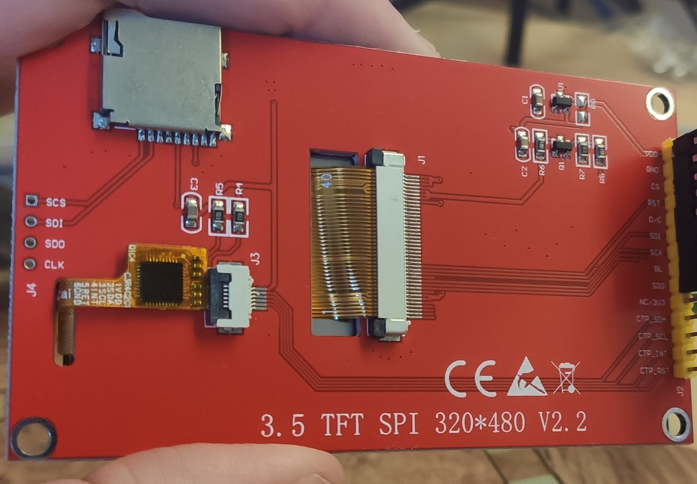
фото 2
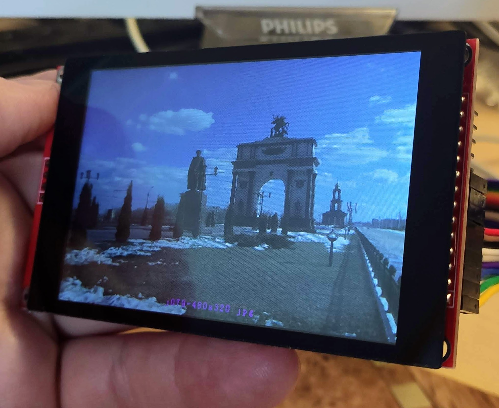

для него тест (main.c) лежит в директории 01_UTFU/app/test/TFT3_5SP_9488

соединения

надо соединить по схеме:
~~~
connect to TFT3_5SP_9488
---- ------
W801  LCD   
---- ------
PB21  CTP_RST     сброс CTP
PA09  CTP_INT     прерывание
PA01  CTP_SCL     
PA04  CTP_SDA     
      NC/3V3 
PB16  SDO         MISO
3.3v  BL          подсветка
PB15  SCK         синхросигнал
PB17  SDI         MOSI
PB23  D/C         комманда/данные
PB21  RST         сброс
PB14  CS          выбор чипа
gnd   GND         земля
3v3   VDD         питание (3.3v - 5v)
---- ------
W801  LCD   
---- ------

*подготовка изображений для SD Card + используется библиотека libTJPEG.a

# convert *.jpg -resize 480x320! j%03d-480x320.jpg

~~~

--------------------------------------------------

------------------------------------------------

board HLK-W801-KIT-V1.1 + 2.8 TFT 240x320 MSP2834 или MSP3223 

Видео

Дисплей
фото 1 
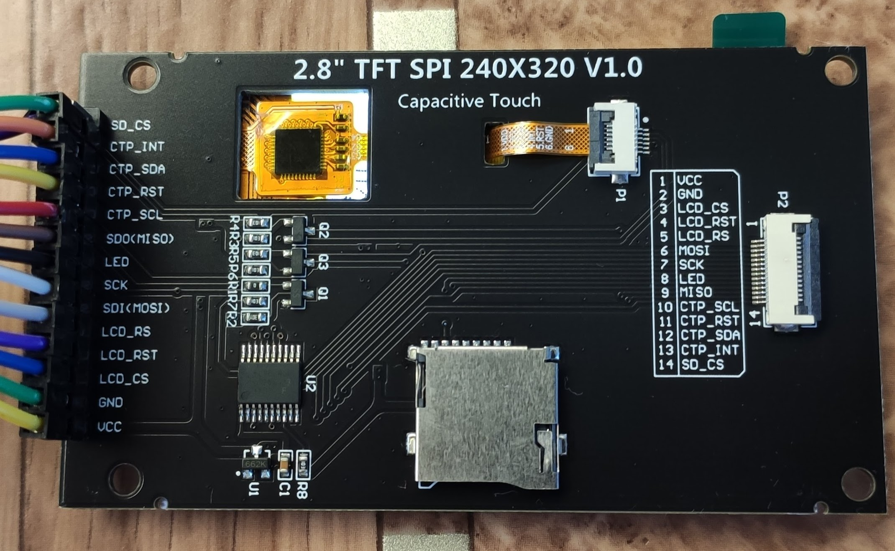
фото 2
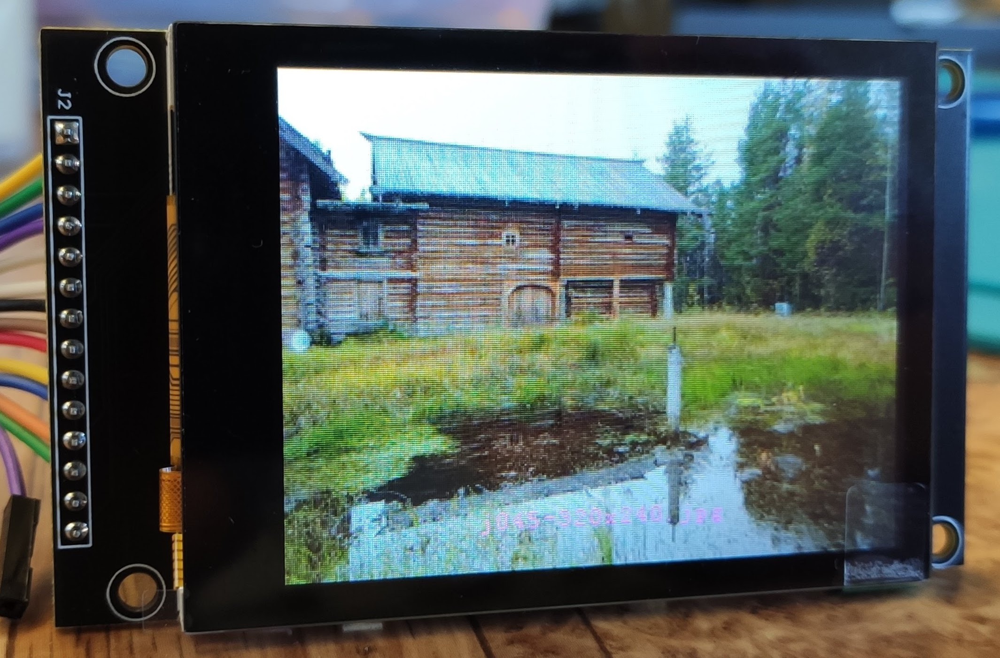

wiki
http://www.lcdwiki.com/2.8inch_IPS_SPI_Module_ILI9341
такой же по софту
http://www.lcdwiki.com/3.2inch_IPS_SPI_Module_ILI9341

для него тест (main.c) лежит в директории 01_UTFU/app/test/MSP2834

соединения

надо соединить по схеме:
~~~
connect to MSP2834 or MSP3223
---- ------
W801  LCD   
---- ------
      SD_CS
PA09  CTP_INT     прерывание
PA04  CTP_SDA     
PB21  CTP_RST     сброс CTP  (не должен висеть "в воздухе"!)
PA01  CTP_SCL     
PB16  SDO(MISO)
3.3v  LED         подсветка
PB15  SCK         синхросигнал
PB17  SDI(MOSI)
PB23  LCD_RS      комманда/данные
PB21  LCD_RST     сброс
PB14  LCD_CS      выбор чипа
gnd   GND         земля
3v3   VDD         питание (3.3v - 5v)
---- ------
W801  LCD   
---- ------

*подготовка изображений для SD Card + используется библиотека libTJPEG.a
# convert *.jpg -resize 320x240! j%03d-320x240.jpg

~~~

--------------------------------------------------

------------------------------------------------

board HLK-W801-KIT-V1.1 + 3.2 TFT 240x320 MSP3223

Видео

Дисплей
фото 1 
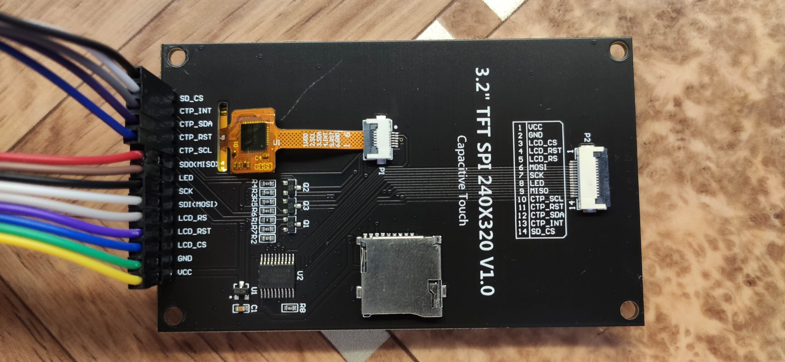
фото 2
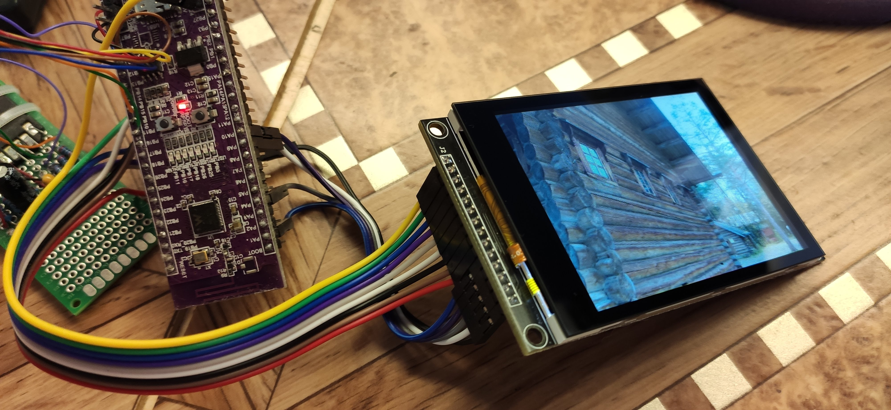

wiki
http://www.lcdwiki.com/3.2inch_IPS_SPI_Module_ILI9341

для него тест (main.c) лежит в директории 01_UTFU/app/test/MSP3223

соединения

надо соединить по схеме:
~~~
connect to MSP3223
---- ------
W801  LCD   
---- ------
      SD_CS
PA09  CTP_INT     прерывание
PA04  CTP_SDA     
PB21  CTP_RST     сброс CTP  (не должен висеть "в воздухе"!)
PA01  CTP_SCL     
PB16  SDO(MISO)
3.3v  LED         подсветка
PB15  SCK         синхросигнал
PB17  SDI(MOSI)
PB23  LCD_RS      комманда/данные
PB21  LCD_RST     сброс
PB14  LCD_CS      выбор чипа
gnd   GND         земля
3v3   VDD         питание (3.3v - 5v)
---- ------
W801  LCD   
---- ------

*подготовка изображений для SD Card + используется библиотека libTJPEG.a
# convert *.jpg -resize 320x240! j%03d-320x240.jpg

~~~

--------------------------------------------------

 

------------------------------------------------

board HLK-W801-KIT-V1.1 + 3.2 TFT IPS 320xRGBx480 MSP3526

Видео
https://youtu.be/y2GYyCNDz_s

[3.2 TFT IPS 320xRGBx480 MSP3526](https://rutube.ru/video/4db9d73c6b09d5c772550671216374d2/)

Дисплей
фото 1 
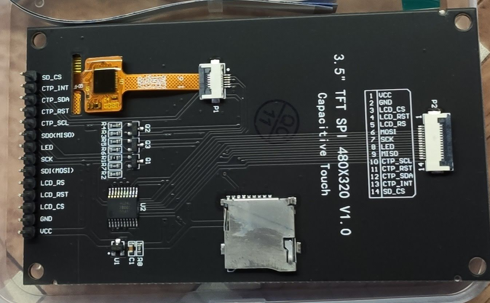
фото 2
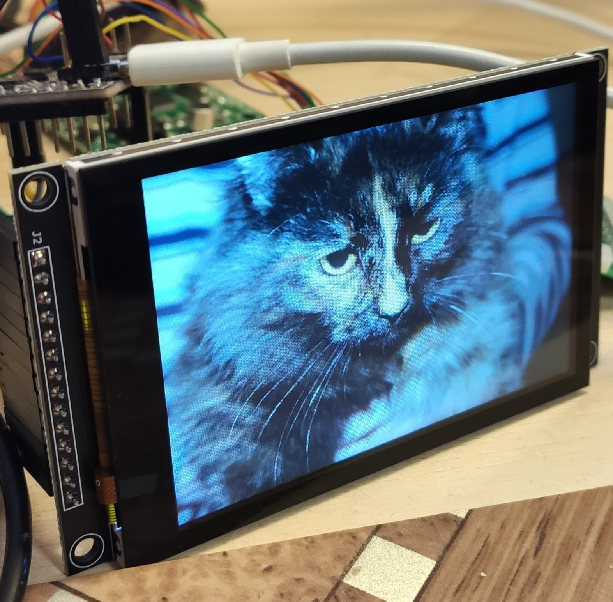

wiki
http://www.lcdwiki.com/3.5inch_IPS_SPI_Module_ST7796

для него тест (main.c) лежит в директории 01_UTFU/app/test/MSP3526

соединения

надо соединить по схеме:
~~~
connect to MSP3526
---- ------
W801  LCD   
---- ------
      SD_CS
PA09  CTP_INT     прерывание
PA04  CTP_SDA     
PB21  CTP_RST     сброс CTP  (не должен висеть "в воздухе"!)
PA01  CTP_SCL     
PB16  SDO(MISO)
3.3v  LED         подсветка
PB15  SCK         синхросигнал
PB17  SDI(MOSI)
PB23  LCD_RS      комманда/данные
PB21  LCD_RST     сброс
PB14  LCD_CS      выбор чипа
gnd   GND         земля
3v3   VDD         питание (3.3v - 5v)
---- ------
W801  LCD   
---- ------

*подготовка изображений для SD Card + используется библиотека libTJPEG.a
# convert *.jpg -resize 480x320! j%03d-480x320.jpg

версия с использованием SDIO (60 Mhz) 
01_UTFU/app/test/MSP3526/spi_SDIO

для SDIO надо соединить по схеме:
connect to MSP3526
---- ------
W801  LCD   
---- ------
      SD_CS
PA09  CTP_INT     прерывание
PA04  CTP_SDA     
PB21  CTP_RST     сброс CTP  (не должен висеть "в воздухе"!)
PA01  CTP_SCL     

      SDO(MISO)
3.3v  LED         подсветка
PB06  SCK         синхросигнал
PB07  SDI(MOSI)
PB22  LCD_RS      комманда/данные
PB21  LCD_RST     сброс
PB23  LCD_CS      выбор чипа
gnd   GND         земля
3v3   VDD         питание (3.3v - 5v)
---- ------
W801  LCD   
---- ------

~~~

--------------------------------------------------

------------------------------------------------

board HLK-W801-KIT-V1.1 + 3.5 TFT 320x480 HW SPI SDIO 120Mhz MHS3528

Видео
https://youtu.be/vrIQAcVDOHw

[3.5 TFT 320x480 HW SPI SDIO 120Mhz MHS3528]https://rutube.ru/video/4675747666eb74dab3d981ca504370b4/

Дисплей
фото 1 
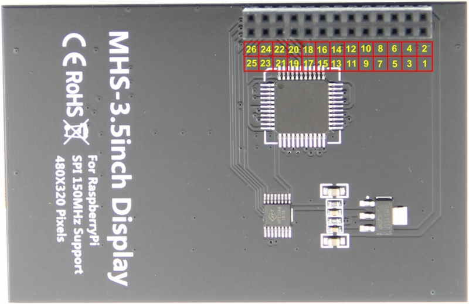
фото 2
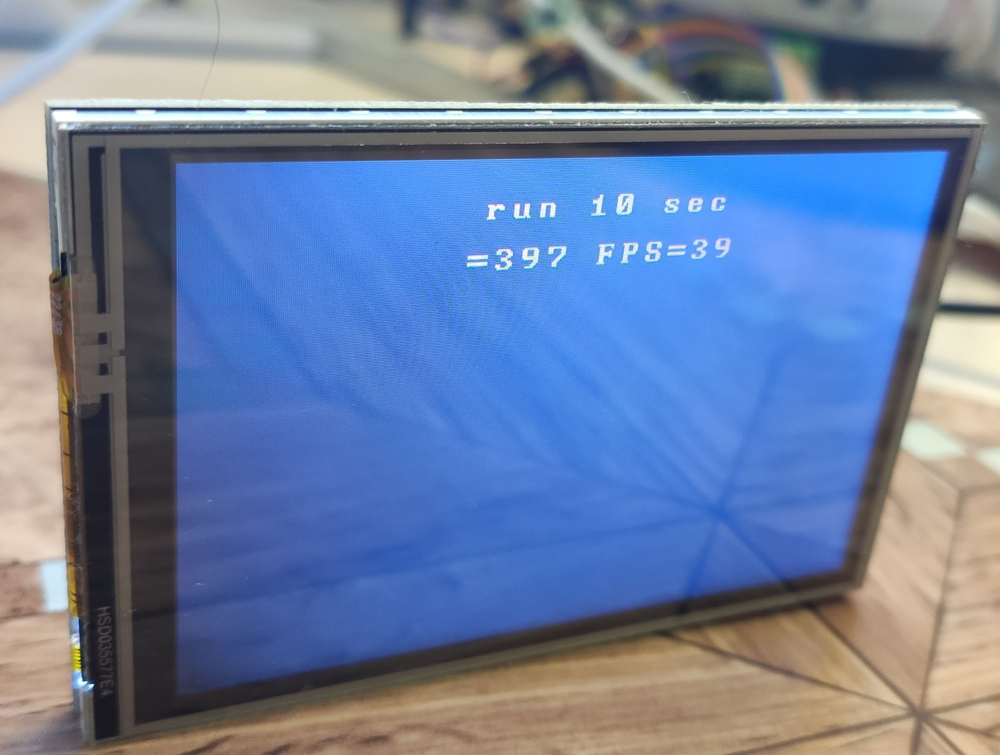

wiki
http://www.lcdwiki.com/MHS-3.5inch_RPi_Display

для него тест (main.c) лежит в директории 
01_UTFU/app/test/MHS3528

версия с использованием SDIO (120Mhz)
01_UTFU/app/test/MHS3528/spi_SDIO

соединения

для SDIO надо соединить по схеме:
~~~
connect to MHS3528
-------- ----- --------
    W801  LCD  W801
-------- ----- --------
     gnd 25 26
SCK PB06 23 24 PB23 CS 
         21 22 PB21 RESET 
SDI PB07 19 20
         17 18 PB22 D/C 
         15 16
         13 14
         11 12
          9 10
          7 8
          5 6  gnd 
          3 4
    3.3v  1 2  5v
-------- ----- --------
    W801  LCD  W801
-------- ----- --------

в результате тут нельзя подключить SD карту, интерфейс SDIO занят (его надо переделывать на SPI)
~~~

------------------------------------------------

------------------------------------------------

board HLK-W801-KIT-V1.1 + 1.9 TFT SPI 170xRGBx320 

по углам обзора - похоже на IPS

Видео

Дисплей
фото 1 
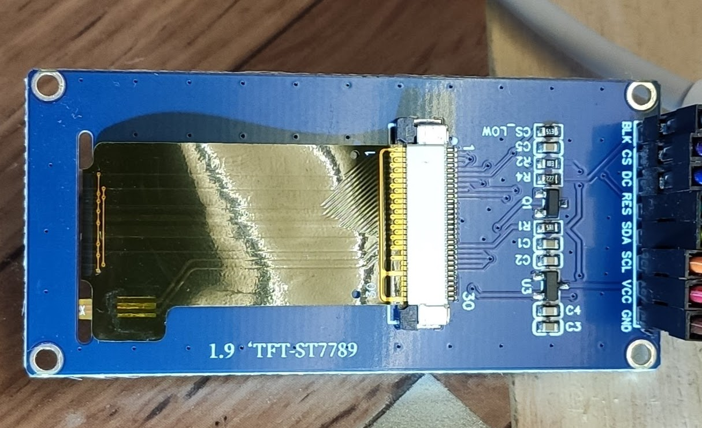
фото 2
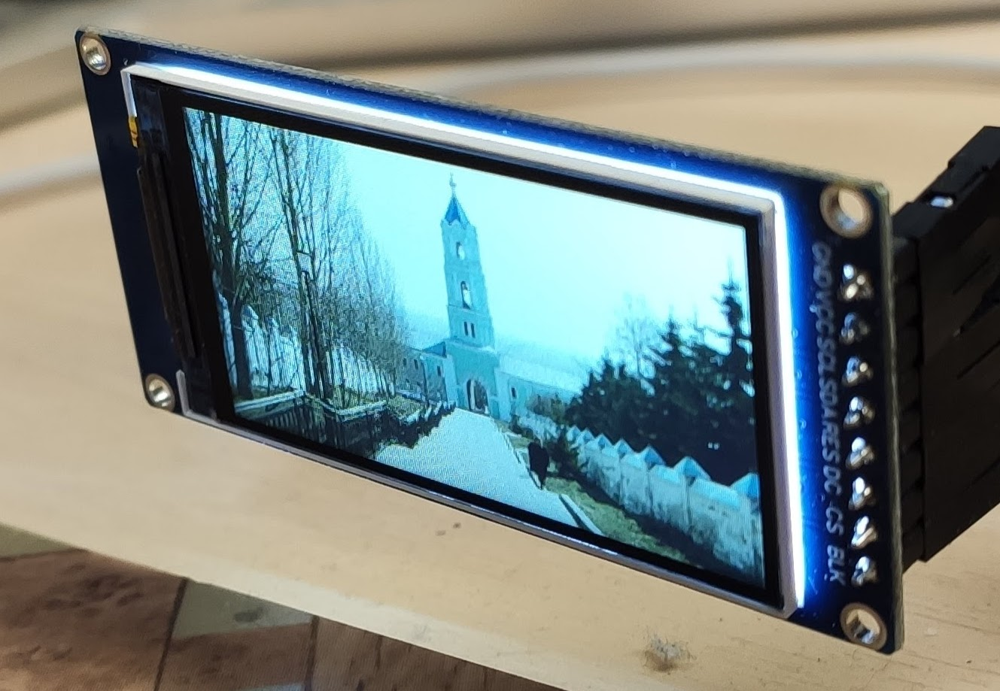

для него тест (main.c) лежит в директории 01_UTFU/app/test/TFT01_9V89

соединения

надо соединить по схеме:
~~~
connect to TFT01_9V89 
---- ------
W801 LCD   
---- ------
gnd  GND  
3.3v VCC
PB15 SCL  синхросигнал
PB17 SDA  данные
PB21 RES  сброс (reset)
PB23 DC   команда/данные
PB14 CS   выбор чипа
3.3v BLK  подсветка
---- ------
W801 LCD   
---- ------

*подготовка изображений для SD Card (инф.ниже)
# convert *.jpg -resize 320x170! j%03d-320x170.jpg

~~~

------------------------------------------------

------------------------------------------------

board HLK-W801-KIT-V1.1 + 3.2 TFT IPS 320xRGBx480 MSP3525

Видео

Дисплей
фото 1 
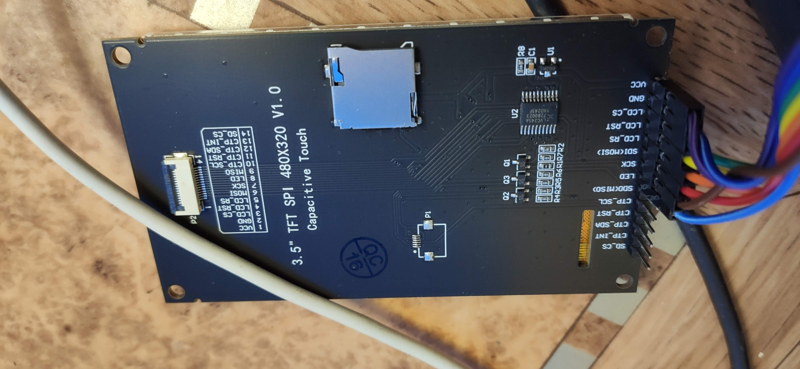
фото 2
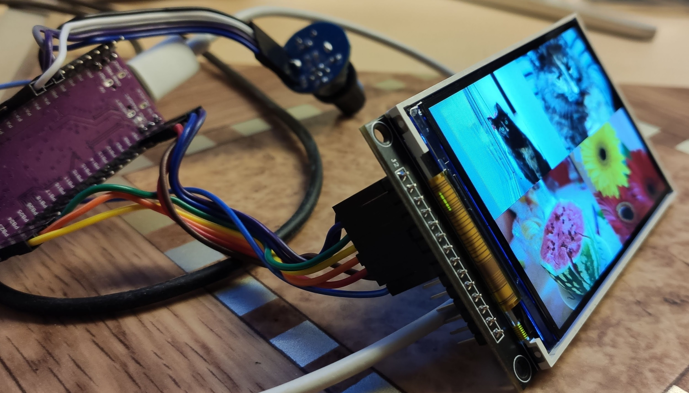

wiki
http://www.lcdwiki.com/3.5inch_IPS_SPI_Module_ST7796

для него тест (main.c) лежит в директории 01_UTFU/app/test/MSP3525

соединения

надо соединить по схеме:
~~~
connect to MSP3525
---- ------
W801  LCD   
---- ------
      SD_CS
      CTP_INT     не исп.
      CTP_SDA     не исп.
      CTP_RST     не исп.
      CTP_SCL     не исп.
PB16  SDO(MISO)
3.3v  LED         подсветка
PB15  SCK         синхросигнал
PB17  SDI(MOSI)
PB23  LCD_RS      комманда/данные
PB21  LCD_RST     сброс
PB14  LCD_CS      выбор чипа
gnd   GND         земля
3v3   VDD         питание (3.3v - 5v)
---- ------
W801  LCD   
---- ------

*подготовка изображений для SD Card + используется библиотека libTJPEG.a
# convert *.jpg -resize 480x320! j%03d-480x320.jpg

версия с использованием SDIO (60 Mhz) 
01_UTFU/app/test/MSP3525/spi_SDIO

для SDIO надо соединить по схеме:
connect to MSP3525
---- ------
W801  LCD   
---- ------
      SD_CS
      CTP_INT   
      CTP_SDA     
      CTP_RST   
      CTP_SCL     
      SDO(MISO)
3.3v  LED         подсветка
PB06  SCK         синхросигнал
PB07  SDI(MOSI)
PB22  LCD_RS      комманда/данные
PB21  LCD_RST     сброс
PB23  LCD_CS      выбор чипа
gnd   GND         земля
3v3   VDD         питание (3.3v - 5v)
---- ------
W801  LCD   
---- ------

~~~

--------------------------------------------------

--------------------------------------------------
--------------------------------------------------

------------------------------------------------

------------------------------------------------

Если нужно, в тесте дисплея Вывод картинок,то надо подключить SD Card
на SD Card должны быть файлы изображения типа .BMP, не сжатыйе,
 подготовленный в нужном разрешении с палитрой 565
в названии (en) должно быть разрешения текущего подключенного дисплея,
например "mkar1-320x172.bmp"

Как подготовить файлы, способы:
1)с помощью конверторов идущих с библиотекой UTFT
   http://www.rinkydinkelectronics.com/library.php?id=51
 в raw формат

2) для Linux, это можно сделать с помощью утилиты convert, входящую в состав
ImageMagick. [Руководство пользователя ImageMagickv. 7.1.0](https://coollib.net/b/558566-ivan-georgievich-titarenko-rukovodstvo-polzovatelya-imagemagick-v-710)
 или
 https://www.altlinux.org/ImageMagick_-_%D0%BE%D0%B1%D1%80%D0%B0%D0%B1%D0%BE%D1%82%D0%BA%D0%B0_%D0%B8%D0%B7%D0%BE%D0%B1%D1%80%D0%B0%D0%B6%D0%B5%D0%BD%D0%B8%D0%B9

например, конвертировать все изображения png (или jpg ниже), текущей
директории, в bmp формат размера 172 на 320 без сохранения соотношения сторон
для формата цвета пикселя RGB565 (такой нужен для TFT дисплея)

# convert *.jpg -resize 320x172! -rotate 180 -define bmp:subtype=RGB565 j%03d-320x172.bmp

если используется библиотека libTJPEG.a
# convert *.jpg -resize 320x172! j%03d-320x172.jpg

~~~
sdio host  (и тогда, sdio режим вывода на дисплей недоступен)
Подключаем SD Card по схеме
W801	Pin #	SD 4-bit Mode	Описание
-----  -------------------------------------------------
PB10	9	DAT[2]		Data Line 2 /Read Wait
 PB11	1	CD/DAT[3]	Data Line 3
 PB07	2	CMD		Command Line
 Gnd	3	VSS1		Ground
 3.3v	4	VDD		Supply Voltage
 PB06	5	CLK		Clock
 Gnd	6	Vss2		Ground
 PB08	7	DAT[0]		Data Line 0
 PB09	8	DAT[1]		Data Line 1 / Interrupt
-----  -------------------------------------------------

SD Card 
Вид со стороны контактов (с низу)
  ---------
 |12345678|
|9        |
|         |
| SD Card |
|         |
-----------

рядом с считывателем
Контакты 1,2,7,8,9 - подключаем через резисторы, примерно ~10кОм...100кОм к +3.3v контакт 4
К контактам Gnd(3,6) и +3.3v(4) - подключам конденсаторы, керамический ~0,047мКф и электролит ~10мКф от помех...

~~~

---------------------------------------------

-----------------------------
возможно, после сборки, файл libUTFT.a 
лежит ./bin/build/w800/lib/libUTFT.a
при необходимости закинуть в общие библиотеки ./lib/w800/mod1
(и ещё libTJPEG.a)

также фалик UTFT.h 
 лежит ./app/UTFT
 скоприровать в директорию ./include/mod1
(и ещё u_jpeg.h лежит в ./app/UTFTjpeg/)

это для других проектов

-----------------------------

-----------------------------
-----------------------------

Сборка  (это не конкретно этого проекта, а к примеру видео https://www.youtube.com/watch?v=uMJ7SQkhtYc 

              https://rutube.ru/video/664a1f911677ecb82c431247c4a5b3b7/?r=wd 
         ):
~~~
делал по инструкциям из этого проекта https://github.com/droppingy/W801_SDK-linux
   у меня Linux Fedora 33 x86_64, думаю для всех Linux x86_64 подойдет

1) сначала, один раз, ставим утилиты для сборки c-sky (архитектура w806, w801 мк)
   благодаря пользователю droppingy это очень просто!  

$ sudo git clone https://github.com/droppingy/hlk-w80x-toolchain.git /opt/w80x-tools

   так чтобы в итоге получилось /opt/w80x-tools/bin
   это чтоб в menuconfig не переделывать, такой там путь по умолчанию
   (еще, в этом мануале https://github.com/IOsetting/wm-sdk-w806, есть ссылки как получить данный Toolchain на другие архитектуры, типа i386)

2) далее качаем SDK

    перемещаемся в домашнюю директорию
 
$ cd ~

    делаем директорию для проекта

$ mkdir w801

$ cd w801  

$ git clone https://github.com/leoay/wm-sdk-w80x-2023.git

3) далее, собираем приложение

$ cd wm-sdk-w80x-2023/

     если тут запустить make, то собирается демо приложение которое идет вместе с SDK, об этом я писал кратко в https://github.com/nvv13/test/tree/main/test-mk/w801 
     но мы хотим собрать другой проект
     для этого удаляем, лишние директории, 
      где app demo - директории с демо приложением
          bin - директория где в результате будет собранное приложение, создастся заново в процессе сборки

$ rm -R app demo bin

     делаем директорию для приложения

$ mkdir app

     и, в данном случае, качаем файлики приложения, 
     для примера, возьмем отсюда https://github.com/nvv13/test/tree/main/test-mk/w801/sdk-prj/02_task_blink
     но, принцип тот же самый и для других...(если нужно много файлов, то можно воспользоваться утилитой https://downgit.github.io/)

$ cd app

$ wget https://github.com/nvv13/test/raw/main/test-mk/w801/sdk-prj/02_task_blink/app/Makefile

$ wget https://github.com/nvv13/test/raw/main/test-mk/w801/sdk-prj/02_task_blink/app/main.c

     возвращаемся в директорию SDK
$ cd ..

     заменяем головной wget Makefile на наш (удалено обращение к директории demo)

$ rm Makefile

$ wget https://github.com/nvv13/test/raw/main/test-mk/w801/sdk-prj/02_task_blink/Makefile

     перед сборкой, очистить проект, иногда надо
$ make distclean

    сборка
$ make 

    перед прошивкой, стереть флэш в микроконтроллере, иногда надо, !когда, допустим был проект с wifi, а стал без него!
$ make erase

    записать прошивку
$ make flash

    Всё!

~~~

Прочее:

  подцепляемся к платке, если интересует вывод на консоль (используеться в проекте)

$ picocom --echo -b 115200 /dev/ttyUSB0

  после подсоединения платка "висит", это из за сигнала RTS (про это есть обьяснение в статье https://www.cnblogs.com/milton/p/15621540.html)
  поэтому делаем CTRL + A + G   - это комманда picocom - RTS down, (нажимать надо достаточно быстро, (одновременно, но сначала CTRL))
  и пользуемся ...
          выход из picocom - CTRL + A + Q  (это выход без сброса порта (Skipping tty reset...))

--------------------------------

исходники библиотеки, взяты отсюда: 
https://wiki.iarduino.ru/page/rabota-s-cvetnym-graficheskim-displeem/ 

добавлен ILI9225B из: 
https://github.com/gnulabis/UTFT-ESP.git 

добавлены русские буквы из: 
https://github.com/twsdwf/UTFT-rus.git

главный источник: 
## License and Credits 
This project is based on the original [UTFT library](http://www.rinkydinkelectronics.com/library.php?id=51) developed and maintained by Henning Karlsen, and licensed under [CC BY-NC-SA 3.0](http://creativecommons.org/licenses/by-nc-sa/3.0/).

исходники для jpeg библиотеки, взяты отсюда:
https://gitee.com/openLuat/LuatOS.git

--------------------------------

