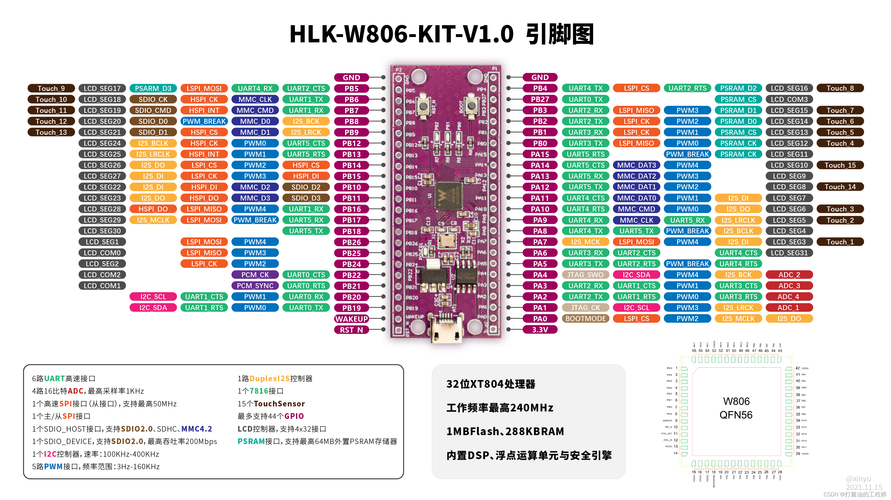

платка 
HLK-W806

~~~

W806 Chip appearance

    QFN56 package, 6mm x 6mm

MCU Features

    Integrated 32-bit XT804 processor, operating frequency 240MHz, built-in DSP, floating point operation unit and security engine

    Built-in 1MB Flash, 288KB RAM

    Integrated PSRAM interface, supports up to 64MB external PSRAM memory

    Integrated 6-way UART high-speed interface

    Integrated 4-channel 16-bit ADC, maximum sampling rate 1KHz

    Integrated 1 high-speed SPI interface (slave interface), supporting up to 50MHz

    Integrates a master/slave SPI interface, up to 20MHz

    Integrated 1 SDIO_HOST interface, supports SDIO2.0, SDHC, MMC4.2 (Configurable interface clock rate, support host rate 0~50MHz)

    Integrate 1 SDIO_DEVICE, support SDIO2.0, maximum throughput 200Mbps (for 4 data line)

    Integrated 1 I2C controller, 100K-400K.

    Integrated GPIO controller, supports up to 44 GPIOs

    Integrated 5-way PWM interface

    Integrated 1-way Duplex I2S controller

    Integrated LCD controller, supports 4x32 interface

    Integrated 1 7816 interface

    Integrated 15 Touch Sensors

    The WAKEUP pin inputs a high level to wake up the chip in the sleep state

    Supports up to 8 channels, 16 DMA request sources, and supports linked list structure and register control.

security features

    The MCU has a built-in Tee security engine, and the code can distinguish between the secure world and the non-secure world.

    Integrated SASC/TIPC, memory and internal modules/interfaces can be configured with security attributes to prevent non-security code access

    Enable firmware signature mechanism to achieve secure Boot/upgrade

    Equipped with firmware encryption function to enhance code security

    Firmware encryption keys are distributed using an asymmetric algorithm to enhance key security

    Hardware encryption module: RC4, AES128, DES/3DES, SHA1/MD5, CRC32, 2048 RSA, true random number generator

low power mode

    3.3V single power supply

    Support work, sleep, standby, shutdown working modes

    Standby power consumption is less than 10uA

 

-----------

архив W806_SDK-linux.tar.gz доступен по ссылке
 https://orangepi.nvv13.keenetic.link/nextcloud/index.php/s/6ZRAwg7taaC6Ho4 

